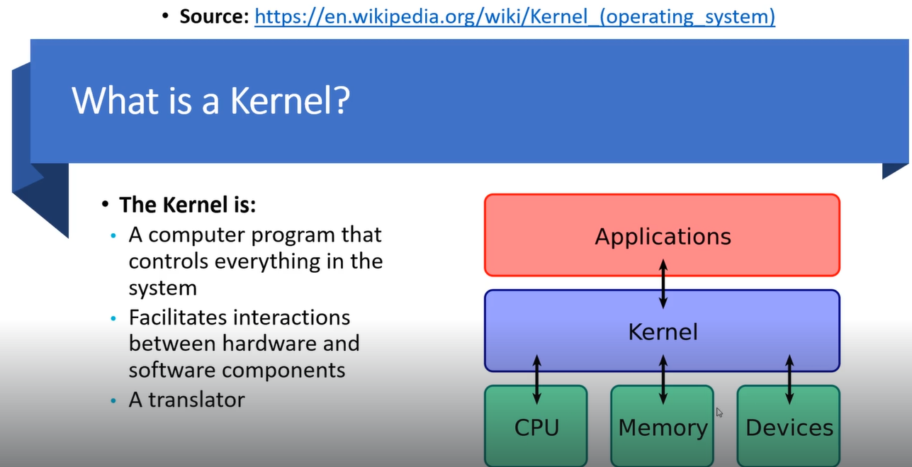

# Overview

Resources for this video:
Kernal exploits
Kernel Exploits - [https://github.com/lucyoa/kernel-exploits](https://github.com/lucyoa/kernel-exploits)

We need to identify what kernel is running on the target machine and then find exploits against it 

---
[Back to Kernel Exploit](./README.md)
