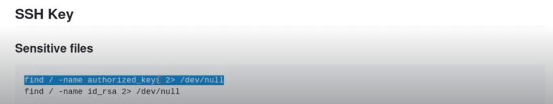
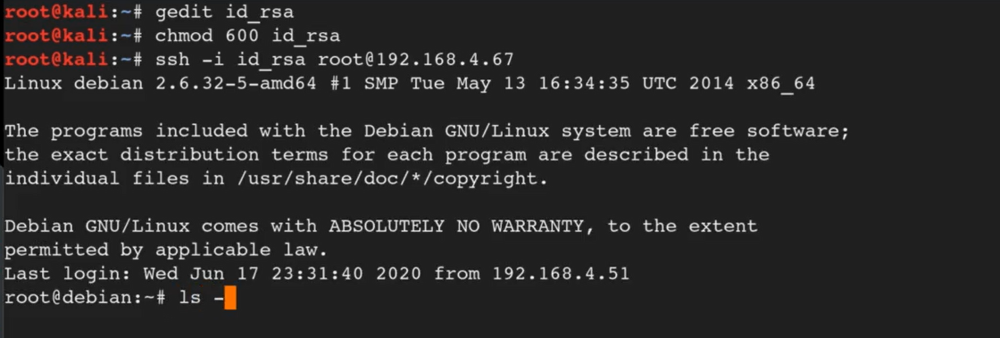

# 🛡️ SSH keys

> **Course Track:** [Linux Privilege Escalation](../../README.md)  
> **Module:** [Passwords & File Permissions](./README.md)  
> **Topic Path:** `Linux Privilege Escalation > Passwords & File Permissions > SSH keys`

---

## 🎯 Technical Overview & Objectives
This section covers the methodology, enumeration techniques, exploit mechanics, and defensive mitigations for **SSH keys**.

---

## 🔬 Practical Notes, Commands & Proof of Exploit


For this we are either 1 looking for the following files if we get both then more good 



*Figure: Privilege Escalation Proof Screenshot*


In the video we found an rsa key 

We copied the rsa key to a file and chmod it to 600
then we ran ssh

```bash
ssh -i id_rsa root@machine_ip
```



*Figure: Privilege Escalation Proof Screenshot*


---

## 🛡️ Defensive Hardening & Remediation
- **Audit & Restrict Permissions:** Review `/etc/sudoers`, remove unnecessary SUID/SGID flags (`chmod u-s`), and enforce strict file ownership on configuration files.
- **Kernel Patching:** Regularly apply distribution security updates to mitigate known local privilege escalation (LPE) vulnerabilities.
- **Principle of Least Privilege:** Avoid running non-administrative daemon processes as `root` and isolate services using containers/namespaces.

---
[⬅ Back to Passwords & File Permissions](./README.md) • [🏠 Master Course Index](../README.md)
