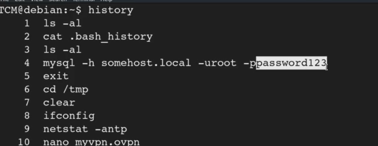

# Stored passwords


Usually it is a best practice to check the history of the commands ran when you get into a machine
Even looking at bash history is a good thing 

```bash
ls -la
#somthing o bash history will pop up use cat on it
```

In the vid


We already got the password here only

Another way to go about this is by using linpeas
Specifically going  on the linpeas pg on github and goin to the section where the stored passwords are there and using their commands
Ofcourse running the whole linpeas is grt

somtimes the passwords are stored in plain text in the ovpn file
So better to cat those and see for yourself if anything is there 


---
[Back to Passwords & File Permissions](./README.md)
