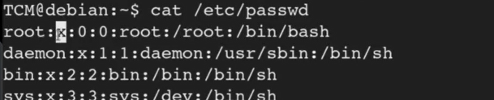
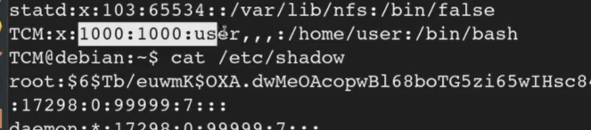

# 🛡️ Weak file permissions

> **Course Track:** [Linux Privilege Escalation](../../README.md)  
> **Module:** [Passwords & File Permissions](./README.md)  
> **Topic Path:** `Linux Privilege Escalation > Passwords & File Permissions > Weak file permissions`

---

## 🎯 Technical Overview & Objectives
This section covers the methodology, enumeration techniques, exploit mechanics, and defensive mitigations for **Weak file permissions**.

---

## 🔬 Practical Notes, Commands & Proof of Exploit


In this we will see how to elevate privilage 
We will check the etc/passwd and etc/shawdow and see how we will be able to compromise the machine using that


```bash
ls -la /etc/passwd
ls -la /etc/shadow
```

The access to the shadow file should not be given to the normal user

the  /etc/passwd file consists the names of the users 
the /etc/shadow contains the passwords



*Figure: Privilege Escalation Proof Screenshot*

The x is the placeholder for the password
If we had permission to modify the file then we could remove the “x” and then we will be able to login without the need of the password



*Figure: Privilege Escalation Proof Screenshot*

Even we can change the id of the group to 0 and become the root user 

when you have read access to both the files them we can copy the contents of the file and put them in two different files and then use the unshadow to crack them


```bash
unshadow <etc/passwd file> <etc/shadow file>
```
What  his will do is, it will put the password hash in the place of the “*” of the etc/file
Then we can copy that content
This is very usefull if there are a lot of users and passwords

Now to crack the hash with hashcat we need to first know what type of hash it is 
For this we can google: hashcat hash types (Probably the first website you get should be of hashcat and this will allow you to be able to search the hash type

In this case it was -1800

so then we run hashcat simple


---

## 🛡️ Defensive Hardening & Remediation
- **Audit & Restrict Permissions:** Review `/etc/sudoers`, remove unnecessary SUID/SGID flags (`chmod u-s`), and enforce strict file ownership on configuration files.
- **Kernel Patching:** Regularly apply distribution security updates to mitigate known local privilege escalation (LPE) vulnerabilities.
- **Principle of Least Privilege:** Avoid running non-administrative daemon processes as `root` and isolate services using containers/namespaces.

---
[⬅ Back to Passwords & File Permissions](./README.md) • [🏠 Master Course Index](../README.md)
