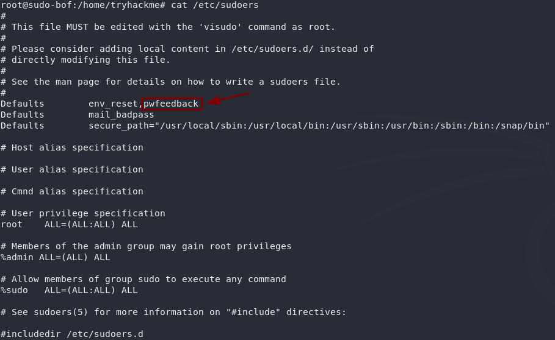
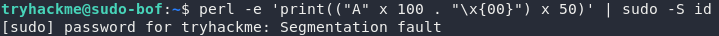

# 🛡️ Sudo buffer overflow

> **Course Track:** [Linux Privilege Escalation](../../README.md)  
> **Module:** [Sudo](./README.md)  
> **Topic Path:** `Linux Privilege Escalation > Sudo > Sudo buffer overflow`

---

## 🎯 Technical Overview & Objectives
This section covers the methodology, enumeration techniques, exploit mechanics, and defensive mitigations for **Sudo buffer overflow**.

---

## 🔬 Practical Notes, Commands & Proof of Exploit

Exploit for CVE-2019-18634 - [https://github.com/saleemrashid/sudo-cve-2019-18634](https://github.com/saleemrashid/sudo-cve-2019-18634)
Affects versions of sudo earlier than 1.8.26.

If you have used Linux before then you might have noticed that passwords typed into the terminal usually don't show any output at all; pwfeedback makes it so that whenever you type a character, an asterisk is displayed on the screen. Inside the /etc/sudoers file it is specified like this:

*Figure: Privilege Escalation Proof Screenshot*

Here's the catch. When this option is turned on, it's possible to perform a buffer overflow attack on the sudo command. To explain it really simply, when a program accepts input from a user it stores the data in a set size of storage space. A buffer overflow attack is when you enter so much data into the input that it spills out of this storage space and into the next "box," overwriting the data in it. As far as we're concerned, this means if we fill the password box of the sudo command up with a lot of garbage, we can inject our own stuff in at the end. This could mean that we get a shell as root! This exploit works regardless of whether we have any sudo permissions to begin with, unlike in CVE-2019-14287 where we had to have a very specific set of permissions in the first place.

*Figure: Privilege Escalation Proof Screenshot*

In this command we're using the programming language Perl to generate a lot of information which we're then passing into the sudo command as a password using the pipe (|) operator. Notice that this doesn't actually give us root permissions -- instead it shows us an error message: Segmentation fault, which basically means that we've tried to access some memory that we weren't supposed to be able to access. This proves that a buffer overflow vulnerability exists: now we just need to exploit it!

---

## 🛡️ Defensive Hardening & Remediation
- **Audit & Restrict Permissions:** Review `/etc/sudoers`, remove unnecessary SUID/SGID flags (`chmod u-s`), and enforce strict file ownership on configuration files.
- **Kernel Patching:** Regularly apply distribution security updates to mitigate known local privilege escalation (LPE) vulnerabilities.
- **Principle of Least Privilege:** Avoid running non-administrative daemon processes as `root` and isolate services using containers/namespaces.

---
[⬅ Back to Sudo](./README.md) • [🏠 Master Course Index](../README.md)
