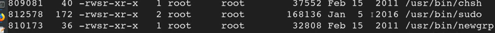
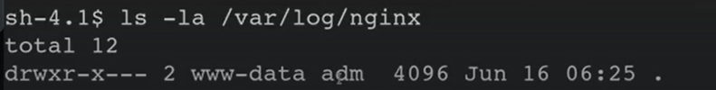

# 🛡️ Binary Symlinks

> **Course Track:** [Linux Privilege Escalation](../../README.md)  
> **Module:** [SUID](./README.md)  
> **Topic Path:** `Linux Privilege Escalation > SUID > Binary Symlinks`

---

## 🎯 Technical Overview & Objectives
This section covers the methodology, enumeration techniques, exploit mechanics, and defensive mitigations for **Binary Symlinks**.

---

## 🔬 Practical Notes, Commands & Proof of Exploit

Resources for this video:
Nginx Exploit - [https://legalhackers.com/advisories/Nginx-Exploit-Deb-Root-PrivEsc-CVE-2016-1247.html](https://legalhackers.com/advisories/Nginx-Exploit-Deb-Root-PrivEsc-CVE-2016-1247.html)

For this exploit, it is required that the user be www-data. To simulate this escalate to root by typing: su root
We typically get this user when we gain access in bug bounties to any webserver

This is a bit complex
This is a vuln of nginx and a little bit of using suid

nginx is a http reverse proxy server, there is a website being hosted on this server, now the issuse in the vuln here is the to deal with the permission of the logs created in nginx, how the permission are set the hacker can use to elevate to root

for detection
1. In command prompt type: 
```bash
dpkg -l | grep nginx
```
1. From the output, notice that the installed nginx version is below 1.6.2-5+deb8u3.
For this to work we need the suid bit set on sudo

```bash
find / -type f -perm -04000 -ls 2>/dev/null
```



*Figure: Privilege Escalation Proof Screenshot*


Futhermore we need to check the log file 

```bash
ls -ls /var/log/nginx
```
We need to have read write and execute



*Figure: Privilege Escalation Proof Screenshot*


Now we can use a symlink to replace the log files with a malicious file
How to do it?
We will run malicious script

Symlink stands for symbolic link, it basically contains a reference to another file

So wt will do is create a symlink and tie it to the log file and when it executes we will get root privileges
The only condition more is that the nginx should restart or start so that the log files get executed and we get the privileges 

After doing all that
We need to wait for the nginx to restart

Just for testing purposes for us to speed things up, we run this

```bash
invoke-rc.d nginx rotate >/dev/null 2>&1
```
And then we get a shell


---

## 🛡️ Defensive Hardening & Remediation
- **Audit & Restrict Permissions:** Review `/etc/sudoers`, remove unnecessary SUID/SGID flags (`chmod u-s`), and enforce strict file ownership on configuration files.
- **Kernel Patching:** Regularly apply distribution security updates to mitigate known local privilege escalation (LPE) vulnerabilities.
- **Principle of Least Privilege:** Avoid running non-administrative daemon processes as `root` and isolate services using containers/namespaces.

---
[⬅ Back to SUID](./README.md) • [🏠 Master Course Index](../README.md)
