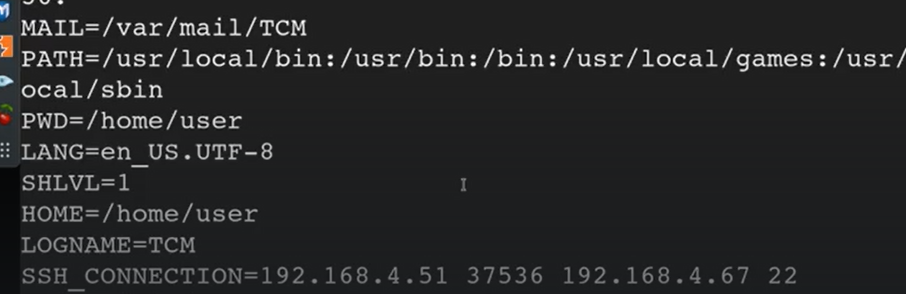
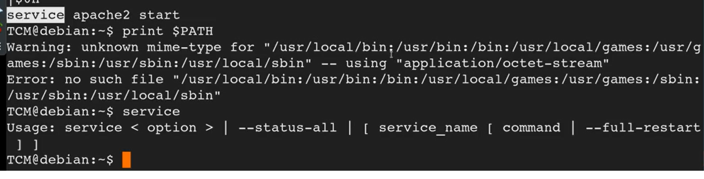
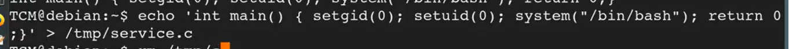
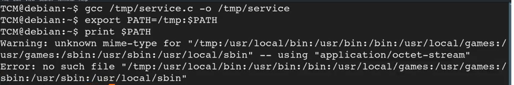
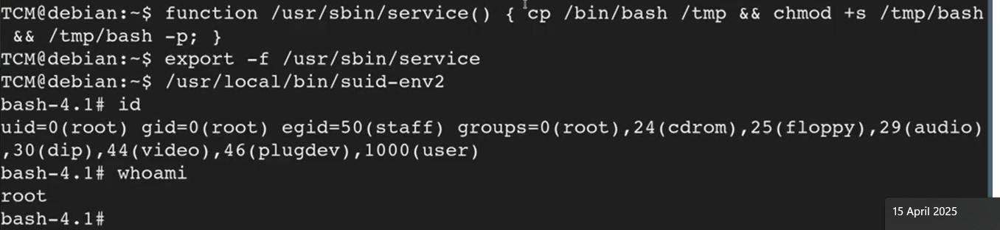

# 🛡️ Environmental Variables

> **Course Track:** [Linux Privilege Escalation](../../README.md)  
> **Module:** [SUID](./README.md)  
> **Topic Path:** `Linux Privilege Escalation > SUID > Environmental Variables`

---

## 🎯 Technical Overview & Objectives
This section covers the methodology, enumeration techniques, exploit mechanics, and defensive mitigations for **Environmental Variables**.

---

## 🔬 Practical Notes, Commands & Proof of Exploit

Environment Variables
Environment variables are values that are defined outside of a program (e.g., in the operating system or shell configuration) and are made available to the program. They can be accessed by child processes and shells.
Characteristics
1. System-wide or user-specific: Environment variables can be defined system-wide or specific to a user.1. Inherited by child processes: When a process creates a child process, the child process inherits the environment variables of the parent process.1. Used for configuration: Environment variables are often used to configure the behavior of programs or shells.
To see the environmental variables

```bash
env
```

eg



*Figure: Privilege Escalation Proof Screenshot*


so we take change this if we have the required suid permissions and use it to elevate our privilages

We use the find to check for suid permissions

```bash
find / -type f -perm -04000 -ls 2>/dev/null
```

We find something interesting


*Figure: Privilege Escalation Proof Screenshot*

So we run it like that

We use string to run it properly again

```bash
string /usr/local/bin/suid-env
```



*Figure: Privilege Escalation Proof Screenshot*


so we c that the service is running and that is like a global variable 

what we will do is



*Figure: Privilege Escalation Proof Screenshot*

we write this c 1 liner
then we compile it using gcc

We then put /temp to some first in path



*Figure: Privilege Escalation Proof Screenshot*


We can also use the function (if like direct path like /usr is given when we use the string to check)



*Figure: Privilege Escalation Proof Screenshot*


Go to the linux privsec of tcm on THM proper commands will be there


---

## 🛡️ Defensive Hardening & Remediation
- **Audit & Restrict Permissions:** Review `/etc/sudoers`, remove unnecessary SUID/SGID flags (`chmod u-s`), and enforce strict file ownership on configuration files.
- **Kernel Patching:** Regularly apply distribution security updates to mitigate known local privilege escalation (LPE) vulnerabilities.
- **Principle of Least Privilege:** Avoid running non-administrative daemon processes as `root` and isolate services using containers/namespaces.

---
[⬅ Back to SUID](./README.md) • [🏠 Master Course Index](../README.md)
