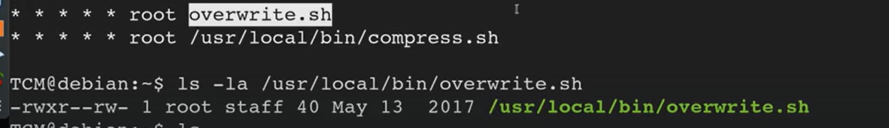

# Cron file overwrites


Always start by


```bash
 cat /etc/crontab
```

So for this example we see the [overwrite.sh](http://overwrite.sh/) being there
We check where it is located using the locate command
and then we check for our permissions


As we can see, We have the read and write permission but not the execute. But it is getting executed in the crontab (Since we have permission to overwrite it we can do that using a reverse shell only very easily. This is very common where we have the overwrite permissions and it is getting executed as root on crontab, its a easy win)

For now we do the following

```bash
echo 'cp /bin/bash /tmp/bash; chmod +s /tmp/bash' >> /usr/local/bin/overwrite.sh
```


---
[Back to Scheduled tasks](./README.md)
