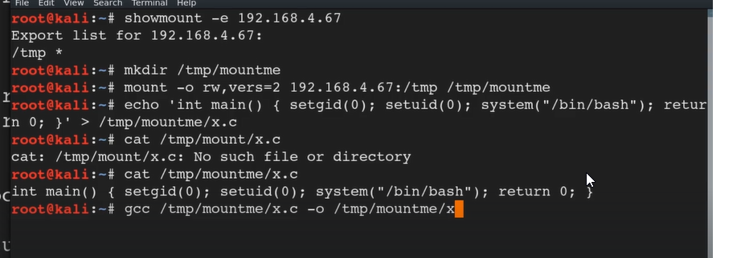

# 📁 NFS Root Squashing

> **Curriculum:** TCM Security — Linux Privilege Escalation  
> **Module Description:** Exploiting no_root_squash misconfigurations in /etc/exports by creating remote SUID root payloads.

---

## 🎯 Learning Objectives & Methodology
Mastering **NFS Root Squashing** involves understanding both the attacker's path to root elevation and the system administrator's hardening requirements.

---


## 📝 Core Documentation & Lab Notes


```bash
cat /etc/exports
```
Check for folders with no root squash
(what it means is, the folder will be sharable and can be mounted if there is no root squash)

then we do this



*Figure: Privilege Escalation Proof Screenshot*


then we give it +s by using chmod 
then we jst need to execute tht file
./x
And we are root


---
[⬅ Back to Linux Privilege Escalation Master Index](../README.md)
