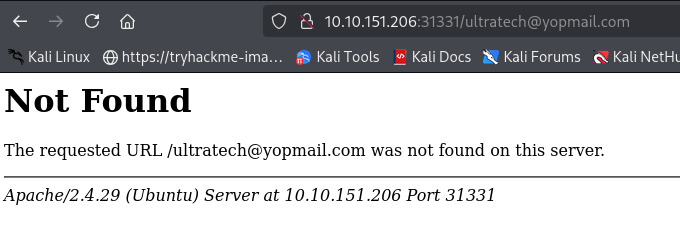
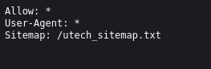
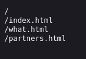
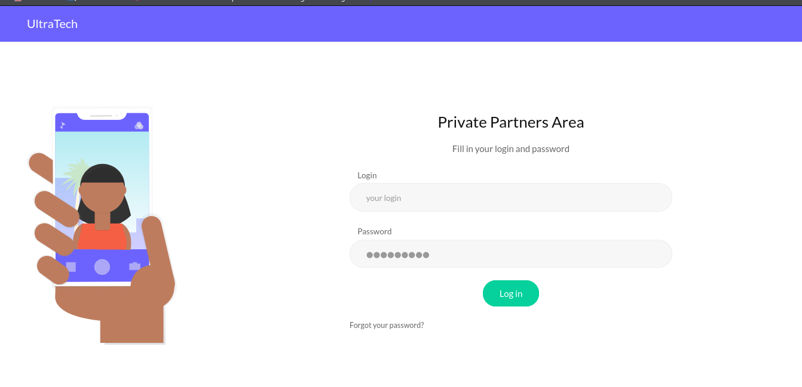
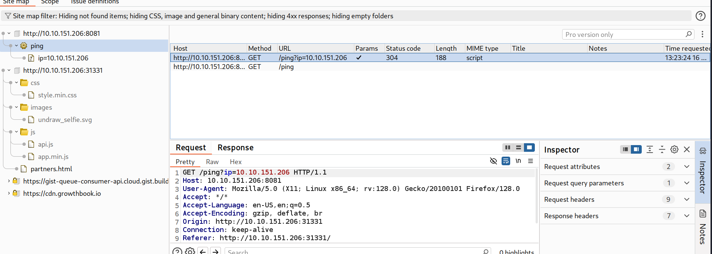
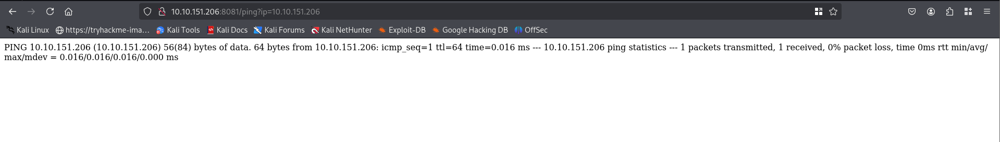
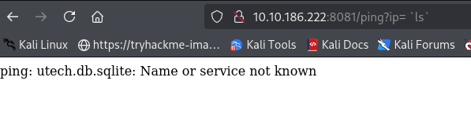
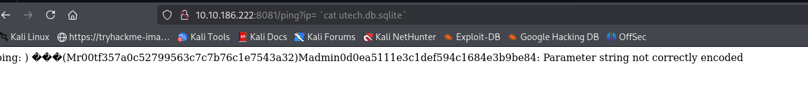

# 📁 Docker

> **Curriculum:** TCM Security — Linux Privilege Escalation  
> **Module Description:** Abusing docker socket / group membership to mount host filesystem root (/) and achieve instant host root takeover.

---

## 🎯 Learning Objectives & Methodology
Mastering **Docker** involves understanding both the attacker's path to root elevation and the system administrator's hardening requirements.

---


## 📝 Core Documentation & Lab Notes

THM - Ultratech

ip = 10.10.151.206

Nmap

```bash
21/tcp    vsftpd 3.0.3
22/tcp    OpenSSH 7.6p1 Ubuntu 4ubuntu0.3 (Ubuntu Linux; protocol 2.0)
8081/tcp  Node.js Express framework
31331/tcp open  http    Apache httpd 2.4.29 ((Ubuntu))

Aggressive OS guesses: Linux 4.15 (98%)
```

8081

```bash
**Browsered to the port and found :**
UltraTech API v0.1.3
```

31331

```bash
**Browsered to the port and found :**
The second comtact page gives the error of not found while revealing the apache info
```



*Figure: Privilege Escalation Proof Screenshot*


Browse to robots.txt



*Figure: Privilege Escalation Proof Screenshot*

Browse to the sitmap which is provided



*Figure: Privilege Escalation Proof Screenshot*

Saw more webpages here
Opened the /partners.html



*Figure: Privilege Escalation Proof Screenshot*


Opened burp

Saw this weird ping request



*Figure: Privilege Escalation Proof Screenshot*

Copied the url and browsed to it



*Figure: Privilege Escalation Proof Screenshot*

This seems like remote code execution is possible

And yes it is possible



*Figure: Privilege Escalation Proof Screenshot*


```bash
`ls`
```
Used backticks instead of quotes it worked

Read the above file and got hash(with username) used crackstation to crack it



*Figure: Privilege Escalation Proof Screenshot*


Got access to the machine

Used the gtfobins to find docker shell exploit 
found
Elevated to root after using it (jst had to change some alibaba thing to bash)


---
[⬅ Back to Linux Privilege Escalation Master Index](../README.md)
