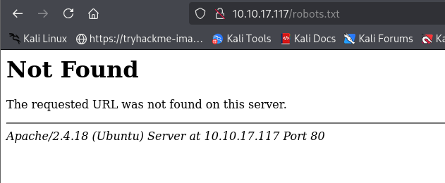
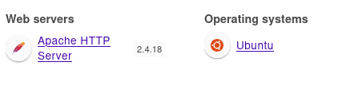
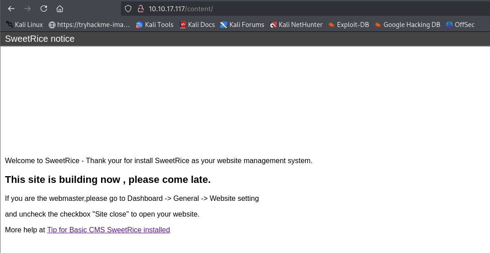
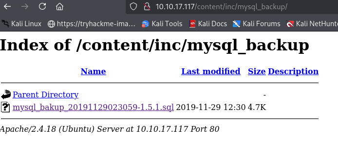

# LazyAdmin

ip= 10.10.17.117

Apache 2.4.18

Wepalyzer - OS ubuntu 

Did directory busting and found pg by sweet rice

Found this as an exploit by googling

Downloaded the file and found password in hash and a username
(got too focused and fogot to write notes, below is wtever i remember)

There was another directory for log in 
Used that
Put the passward and username in that and got login
There was a place to upload files uploaded a reverse shell there with listner on nc
Got shell
Used sudo -l
Found that i hav privilage of perl and backup with no password
The backup file had a reverse shell listner command like
I put my ip there 
And i got a reverse shell again but this time as root

---
[Back to Capstone](./README.md)
