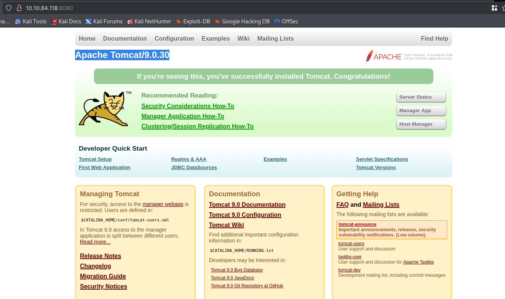
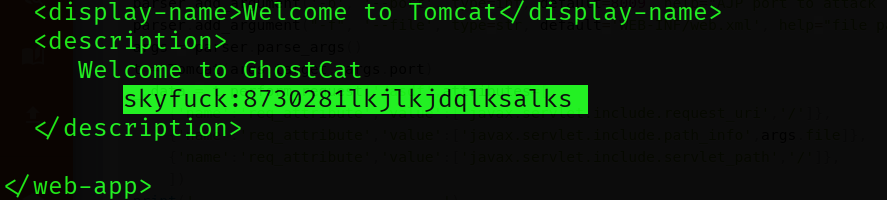
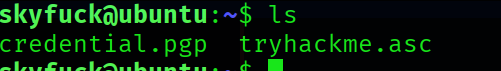
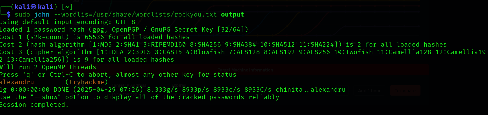
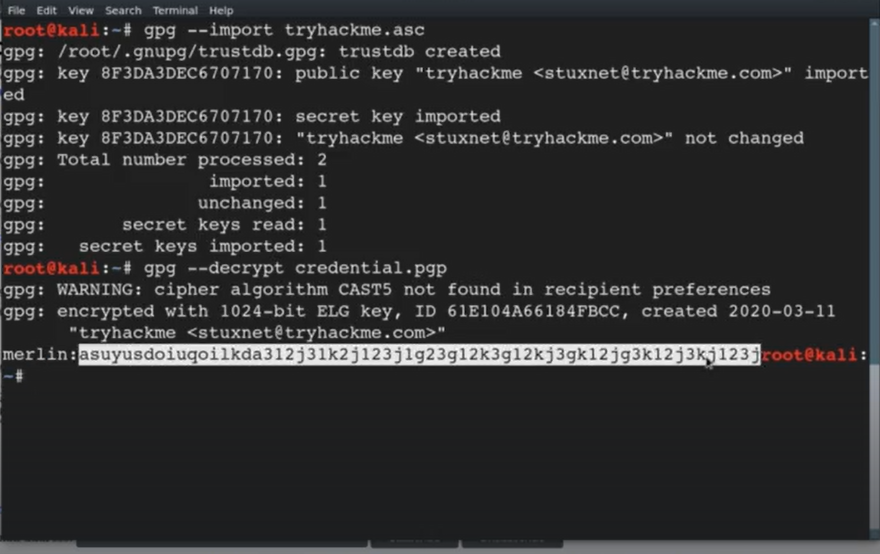

# Tomghost

ip = 10.10.84.118


```bash
nmap scan
```

```bash
nmap -A -T4 -p 22,53,8009,8080 10.10.84.118

Starting Nmap 7.95 ( https://nmap.org ) at 2025-04-20 02:17 EDT
Stats: 0:00:06 elapsed; 0 hosts completed (1 up), 1 undergoing Service Scan
Service scan Timing: About 50.00% done; ETC: 02:18 (0:00:07 remaining)
Nmap scan report for 10.10.84.118
Host is up (0.14s latency).

PORT     STATE SERVICE    VERSION
22/tcp   open  ssh        OpenSSH 7.2p2 Ubuntu 4ubuntu2.8 (Ubuntu Linux; protocol 2.0)
| ssh-hostkey: 
|   2048 f3:c8:9f:0b:6a:c5:fe:95:54:0b:e9:e3:ba:93:db:7c (RSA)
|   256 dd:1a:09:f5:99:63:a3:43:0d:2d:90:d8:e3:e1:1f:b9 (ECDSA)
|_  256 48:d1:30:1b:38:6c:c6:53:ea:30:81:80:5d:0c:f1:05 (ED25519)
53/tcp   open  tcpwrapped
8009/tcp open  ajp13      Apache Jserv (Protocol v1.3)
| ajp-methods: 
|_  Supported methods: GET HEAD POST OPTIONS
8080/tcp open  http       Apache Tomcat 9.0.30
|_http-title: Apache Tomcat/9.0.30
|_http-favicon: Apache Tomcat
Warning: OSScan results may be unreliable because we could not find at least 1 open and 1 closed port
Device type: general purpose
Running: Linux 4.X
OS CPE: cpe:/o:linux:linux_kernel:4.4
OS details: Linux 4.4
Network Distance: 5 hops
Service Info: OS: Linux; CPE: cpe:/o:linux:linux_kernel

TRACEROUTE (using port 53/tcp)
HOP RTT       ADDRESS
1   15.69 ms  10.17.0.1
2   ... 4
5   142.79 ms 10.10.84.118

OS and Service detection performed. Please report any incorrect results at https://nmap.org/submit/ .
Nmap done: 1 IP address (1 host up) scanned in 19.59 seconds
```

Found this on port 8080



Found a cve for this 
( but i din know how to run so saw some vids in 1 i saw that if you just the file with python it will you what what is required,  ps: read the code dumbass)
Had to fix some things in the code (like the buffer= 0 is removed in python 3. and then had to decode a string to utf-8
After running the exploit got this


8730281lkjlkjdqlksalks
Used this credentials in the ssh port to get access n it worked

There are two files we see when we log in there 


We try to read this there but couldn't 
So we transfer this to our machine

```bash
scp [[REDACTED_EMAIL_@10.10.125.220]]:credential.pgp .

scp [[REDACTED_EMAIL_@10.10.125.220]]:tryhackme.asc .
```
Now to decrypt the pgp file we need to have a passphrase
We can get this from the asc file 

Used John the Reaper to decrypt the asc file

```bash
**gpg2john tryhackme.asc > output**
```
Stored the result in a file named output

We got the hash now 
We will use john only to brk the hash



So as we can see the password we got was:
alexandru

Now we have to decrypt the credential.pgp but for that we first have to import the keys from tryhackme.asc(The password we found above will be used)


merlin:asuyusdoiuqoilkda312j31k2j123j1g23g12k3g12kj3gk12jg3k12j3kj123j

Logged in to merlin

```bash
sudo -l
```
Checked if had any sudo privilages
Found had on zip
Used gtfobins and found out there is a way to escalate to root so did that


---
[Back to Capstone](./README.md)
