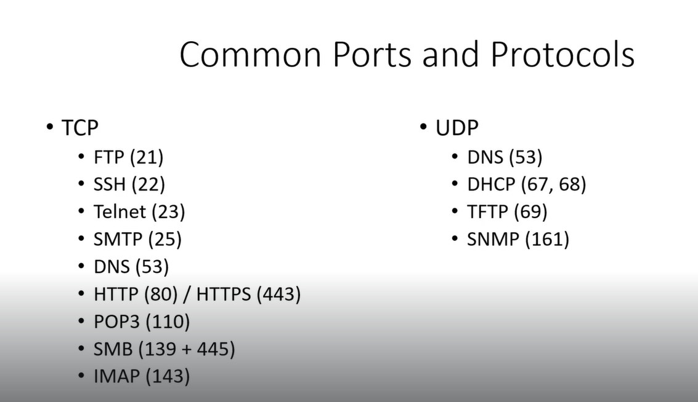

# 🛡️ Common ports

> **Course:** [Practical Ethical Hacking](../../README.md)  
> **Module:** [Networking Refresher](./README.md)  
> **Navigation Path:** `Practical Ethical Hacking > Networking Refresher > Common ports`

---

## 🎯 Executive Summary & Technical Objectives
This document details the practical methodology, tooling, exploitation chain, and defensive remediation for **Common ports** as conducted in the TCM Security lab environment.

---

## 🔬 Hands-On Walkthrough & Technical Evidence

*Figure: Lab Execution Screenshot / Proof of Exploit*

Here are some commonly used ports and the protocols associated with them in computer networking:
- FTP (File Transfer Protocol): Port 21 (TCP)- SSH (Secure Shell): Port 22 (TCP)- Telnet: Port 23 (TCP)- SMTP (Simple Mail Transfer Protocol): Port 25 (TCP)- DNS (Domain Name System): Port 53 (TCP and UDP)- HTTP (Hypertext Transfer Protocol): Port 80 (TCP)- HTTPS (Hypertext Transfer Protocol Secure): Port 443 (TCP)- DHCP (Dynamic Host Configuration Protocol): Port 67 (UDP) and Port 68 (UDP)- POP3 (Post Office Protocol version 3): Port 110 (TCP)- IMAP (Internet Message Access Protocol): Port 143 (TCP)- SNMP (Simple Network Management Protocol): Port 161 (UDP)- RDP (Remote Desktop Protocol): Port 3389 (TCP)- NTP (Network Time Protocol): Port 123 (UDP)- SMB (Server Message Block): Port 445 (TCP)- FTPS (FTP over SSL/TLS): Port 990 (TCP)- TFTP (Trivial File Transfer Protocol): Port 69 (UDP)- LDAP (Lightweight Directory Access Protocol): Port 389 (TCP and UDP)- MySQL: Port 3306 (TCP)- RDP (Remote Desktop Protocol): Port 3389 (TCP)Please
 note that some protocols use both TCP and UDP, depending on the 
specific functionality and requirements. Additionally, these port 
assignments are not exhaustive, and other applications and services may 
use different ports as well.

---

## 🛡️ Defensive Hardening & Detection Signatures
- **Monitoring & Auditing:** Enable granular auditing for process creation (Windows Event ID 4688 / Sysmon Event 1) and network connections (Sysmon Event 3).
- **Least Privilege:** Enforce strict principle of least privilege across user accounts and service configurations.
- **Continuous Validation:** Conduct routine vulnerability scanning and automated configuration reviews to identify drift.

---
[⬅ Back to Networking Refresher](./README.md) • [🏠 Master Course Index](../README.md)
