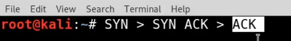

# 🛡️ TCP, UDP and TCP Handshake

> **Course:** [Practical Ethical Hacking](../../README.md)  
> **Module:** [Networking Refresher](./README.md)  
> **Navigation Path:** `Practical Ethical Hacking > Networking Refresher > TCP, UDP and TCP Handshake`

---

## 🎯 Executive Summary & Technical Objectives
This document details the practical methodology, tooling, exploitation chain, and defensive remediation for **TCP, UDP and TCP Handshake** as conducted in the TCM Security lab environment.

---

## 🔬 Hands-On Walkthrough & Technical Evidence

*Figure: Lab Execution Screenshot / Proof of Exploit*

this is the tcp handshake

TCP (Transmission Control Protocol) and UDP (User 
Datagram Protocol) are two commonly used transport layer protocols in 
computer networks.
TCP is a connection-oriented 
protocol that provides reliable, ordered, and error-checked delivery of 
data packets over an IP network. It guarantees that data sent from one 
device is received correctly by the destination device. TCP achieves 
this reliability through mechanisms like acknowledgement, 
retransmission, and flow control. It breaks data into smaller packets, 
assigns sequence numbers to them, and ensures they are reassembled 
correctly at the receiving end. TCP is widely used for applications that
 require guaranteed delivery, such as web browsing, email, file 
transfer, and remote login.
UDP, on the other 
hand, is a connectionless protocol that does not provide the same level 
of reliability as TCP. It is simpler and more lightweight, making it 
suitable for applications that can tolerate some data loss or delay. UDP
 does not establish a connection or guarantee delivery of packets. It 
simply sends data packets from one device to another without waiting for
 acknowledgements or retransmissions. UDP is commonly used for real-time
 applications like streaming media, online gaming, DNS (Domain Name 
System), and VoIP (Voice over IP).
The three-way
 handshake is a process used by TCP to establish a connection between 
two devices. It is a sequence of three steps that takes place before 
data transmission can begin. Here's how the three-way handshake works:
1. SYN (Synchronize): The initiating device (often referred to as the client)
sends a TCP packet with the SYN flag set to the destination device
(often referred to as the server). This packet indicates the desire to
establish a connection and includes an initial sequence number.1. SYN-ACK (Synchronize-Acknowledge): Upon receiving the SYN packet, the
destination device responds with a TCP packet that has both the SYN and
ACK (acknowledge) flags set. This packet acknowledges the receipt of the initial SYN packet and also includes its own initial sequence number.1. ACK (Acknowledge): Finally, the initiating device acknowledges the SYN-ACK
packet by sending an ACK packet back to the destination. This packet
confirms the establishment of the connection and typically contains an
incremented sequence number.Once the 
three-way handshake is complete, the connection is established, and both
 devices are ready to exchange data. The sequence numbers exchanged 
during the handshake are used to ensure that data is transmitted and 
received in the correct order.
In summary, TCP 
is a reliable, connection-oriented protocol that guarantees delivery of 
data, while UDP is a simpler, connectionless protocol that does not 
provide the same level of reliability. The three-way handshake is a 
process used by TCP to establish a connection between devices, involving
 the exchange of SYN, SYN-ACK, and ACK packets.

---

## 🛡️ Defensive Hardening & Detection Signatures
- **Monitoring & Auditing:** Enable granular auditing for process creation (Windows Event ID 4688 / Sysmon Event 1) and network connections (Sysmon Event 3).
- **Least Privilege:** Enforce strict principle of least privilege across user accounts and service configurations.
- **Continuous Validation:** Conduct routine vulnerability scanning and automated configuration reviews to identify drift.

---
[⬅ Back to Networking Refresher](./README.md) • [🏠 Master Course Index](../README.md)
