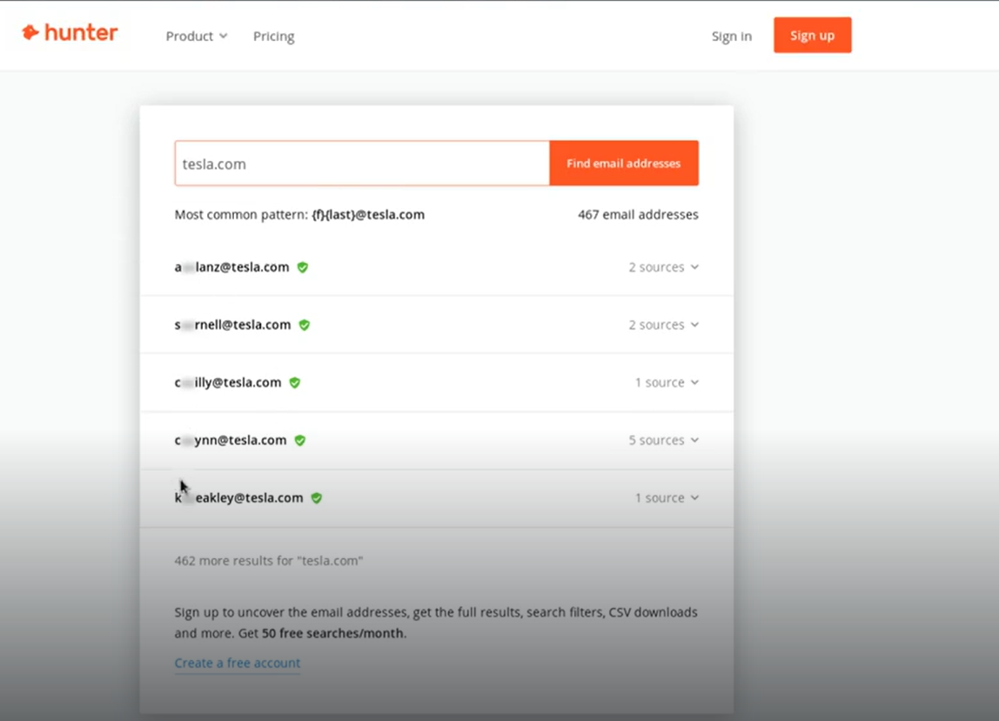
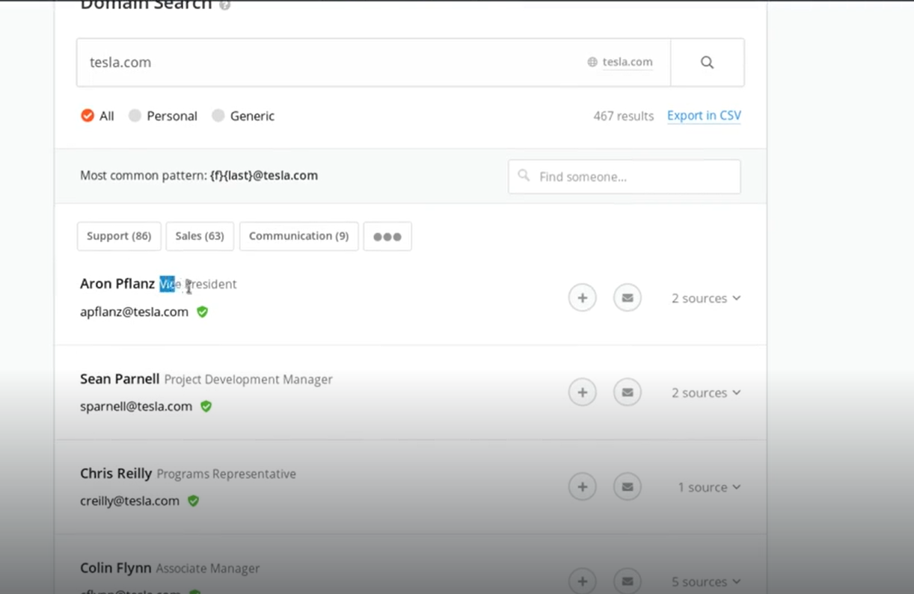
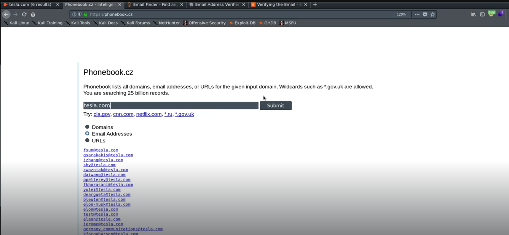
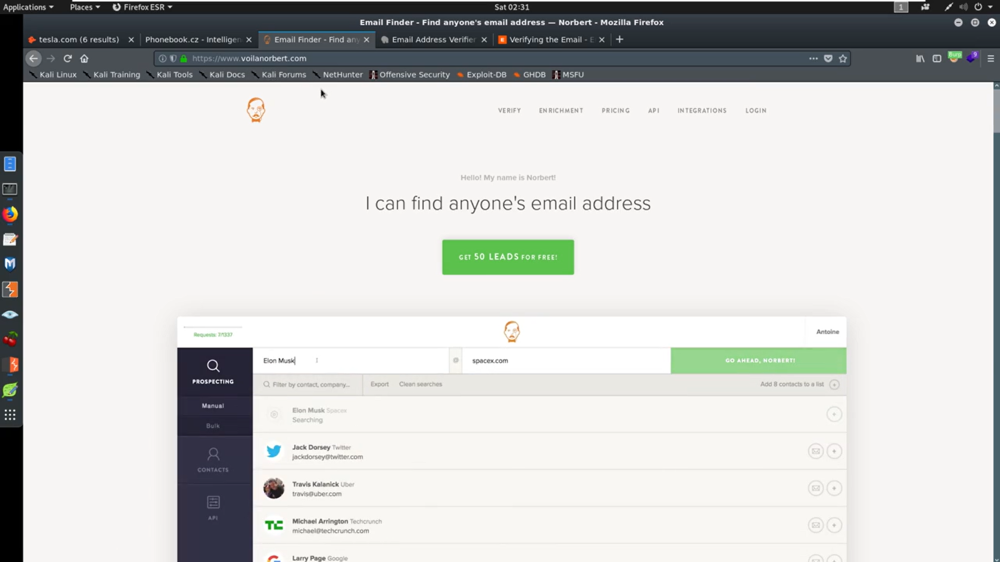
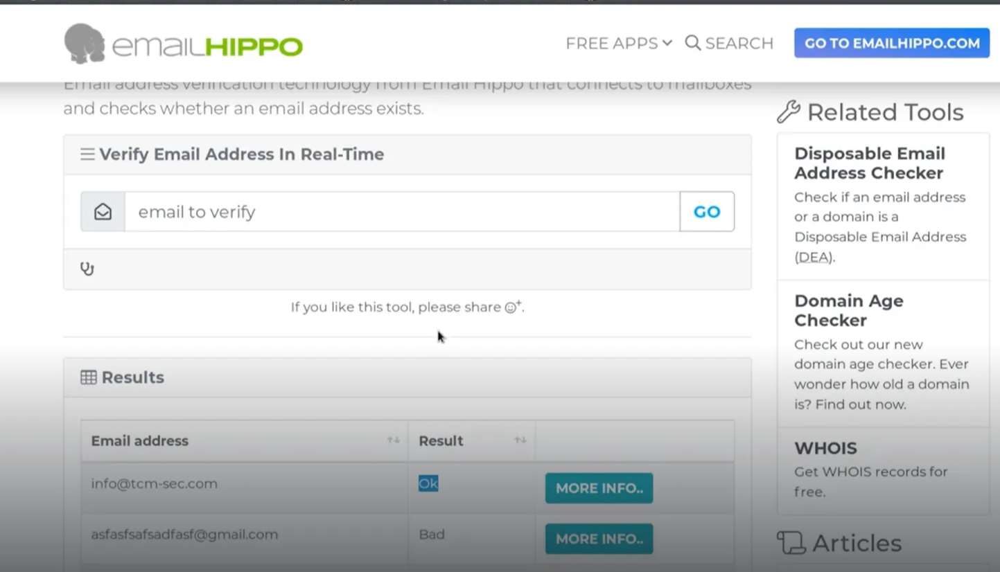
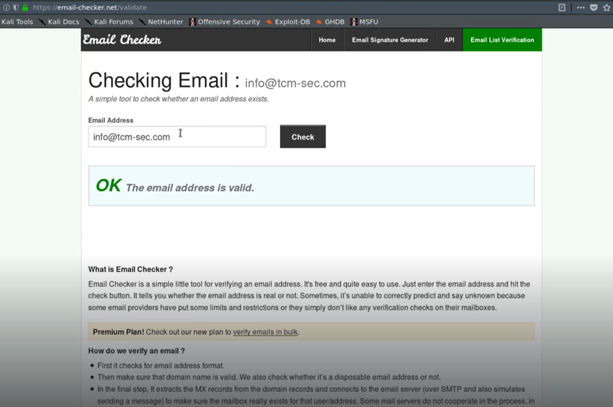

# Discovering Email Addresses

1. hunter.io

After signing in with google you get more information 
eg. Checking in which department who works n no blur

1. phonebook.cz
can search for domains and url also

1. voilanorbert.com

4.clearbit

it has to be used in chrome.
It is a chrome extension which offers a lot of success

1. [tools.verifyemailaddres.io](http://4.tools.verifyemailaddres.io/) (emailhippo)
you can use this to verify email addresses

1. email-checker.net/validate
can be used to validate the email 

---
[Back to Information Gathering](./README.md)
