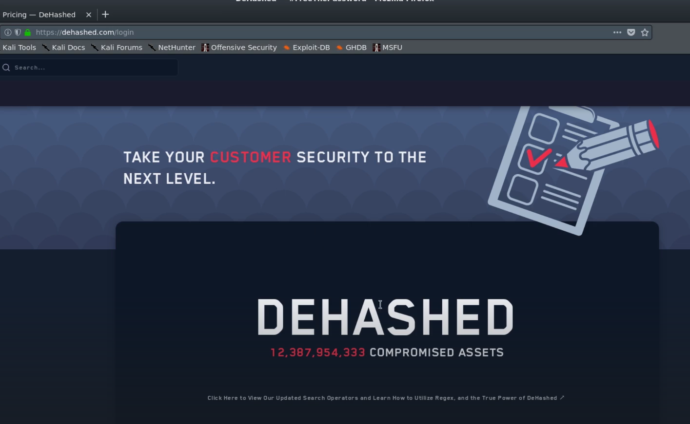

# 🛡️ Hunting Breached Credentials 

> **Course:** [Practical Ethical Hacking](../../README.md)  
> **Module:** [Information Gathering](./README.md)  
> **Navigation Path:** `Practical Ethical Hacking > Information Gathering > Hunting Breached Credentials `

---

## 🎯 Executive Summary & Technical Objectives
This document details the practical methodology, tooling, exploitation chain, and defensive remediation for **Hunting Breached Credentials ** as conducted in the TCM Security lab environment.

---

## 🔬 Hands-On Walkthrough & Technical Evidence

The main websites or applications which we use for this may change overtime very soon. What matter most is the methodology.

For this section we will use the example of Dhased

*Figure: Lab Execution Screenshot / Proof of Exploit*

This is paid tho so keep that in mind

search who the cilent is (eg @tesla.com)
Check for recurring entries of breached info
Take all the info you can get (eg email, password, names, ph no, )
Check for patterns
Try to relate it to their personal accounts 
Then check ways how it will lead you to breaking in the organisation
if can find hash password go to [hashes.org](http://hashes.org/) or any other hashcracking website

---

## 🛡️ Defensive Hardening & Detection Signatures
- **Monitoring & Auditing:** Enable granular auditing for process creation (Windows Event ID 4688 / Sysmon Event 1) and network connections (Sysmon Event 3).
- **Least Privilege:** Enforce strict principle of least privilege across user accounts and service configurations.
- **Continuous Validation:** Conduct routine vulnerability scanning and automated configuration reviews to identify drift.

---
[⬅ Back to Information Gathering](./README.md) • [🏠 Master Course Index](../README.md)
