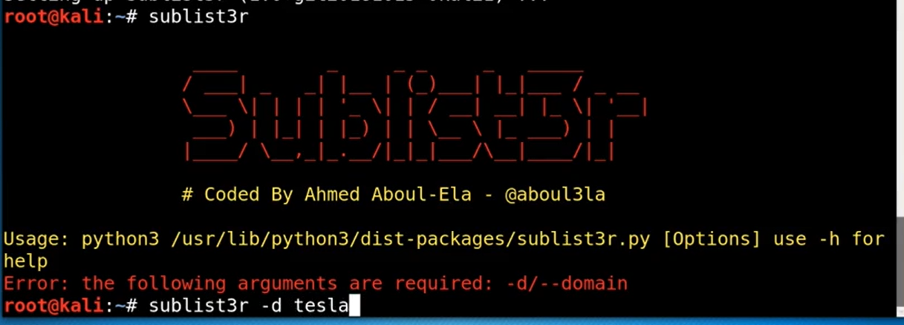
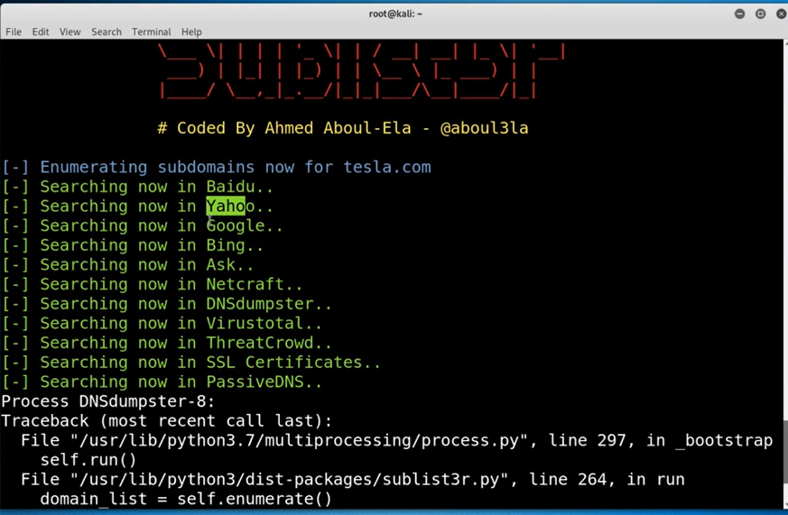
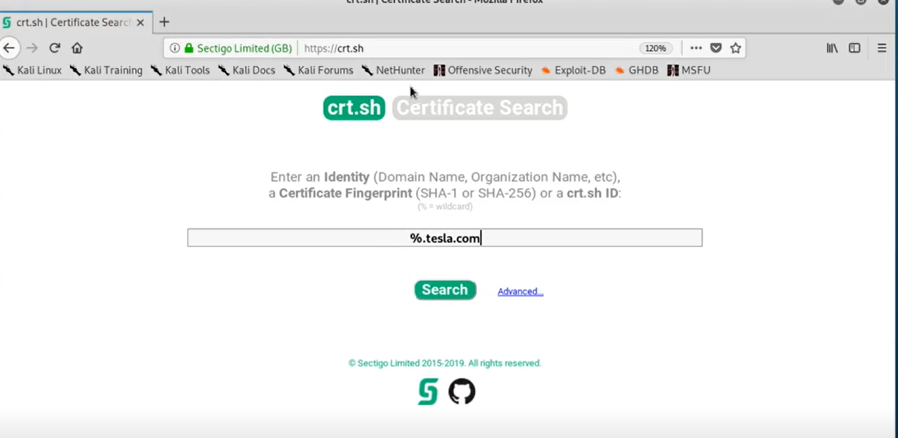
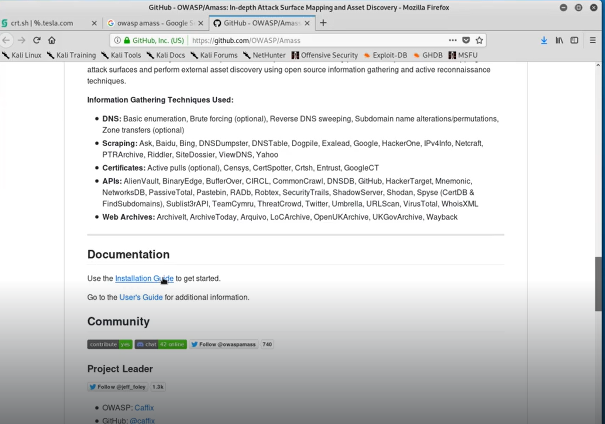
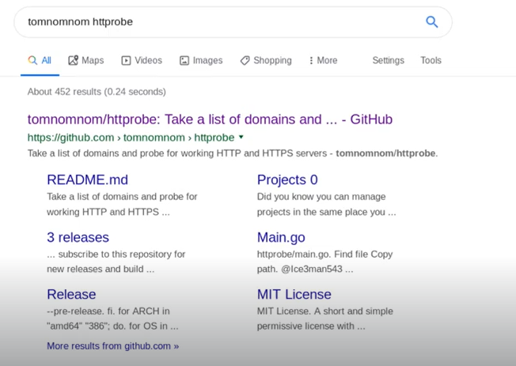

# Hunting Subdomains 1 & 2

1. Can use sublist3r to find domains 

It searches through a lot of things

1. crt.sh
We can use this for certificate fingerprinting

1. Owasp AmassOne of the most popular and go to tools. Can find a lot more domains with this 

1. tomnomnomCan be used to probe the domains to check if they are alive

---
[Back to Information Gathering](./README.md)
