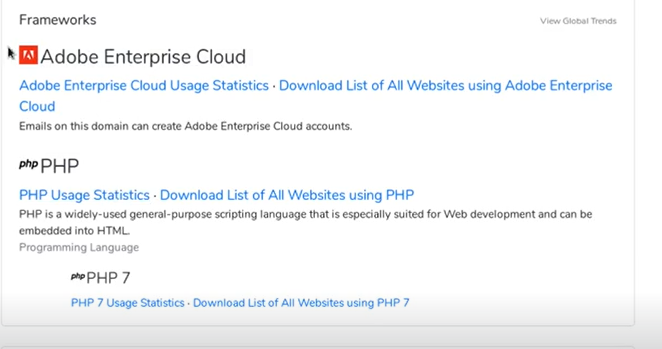
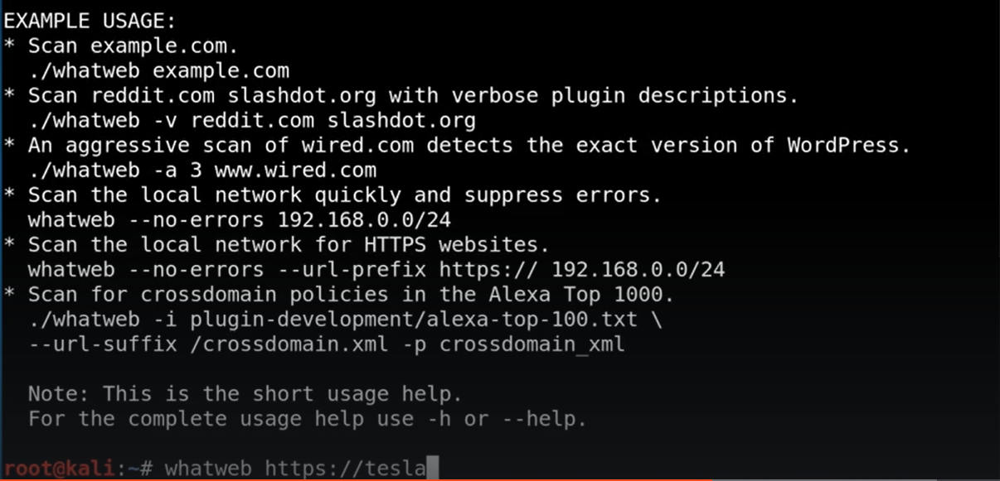

# 🛡️ Identifying Web Technologies Used

> **Course:** [Practical Ethical Hacking](../../README.md)  
> **Module:** [Information Gathering](./README.md)  
> **Navigation Path:** `Practical Ethical Hacking > Information Gathering > Identifying Web Technologies Used`

---

## 🎯 Executive Summary & Technical Objectives
This document details the practical methodology, tooling, exploitation chain, and defensive remediation for **Identifying Web Technologies Used** as conducted in the TCM Security lab environment.

---

## 🔬 Hands-On Walkthrough & Technical Evidence

1. Buildwith.com

*Figure: Lab Execution Screenshot / Proof of Exploit*

1. Wappalyzer

*Figure: Lab Execution Screenshot / Proof of Exploit*

1. whatweb

*Figure: Lab Execution Screenshot / Proof of Exploit*

---

## 🛡️ Defensive Hardening & Detection Signatures
- **Monitoring & Auditing:** Enable granular auditing for process creation (Windows Event ID 4688 / Sysmon Event 1) and network connections (Sysmon Event 3).
- **Least Privilege:** Enforce strict principle of least privilege across user accounts and service configurations.
- **Continuous Validation:** Conduct routine vulnerability scanning and automated configuration reviews to identify drift.

---
[⬅ Back to Information Gathering](./README.md) • [🏠 Master Course Index](../README.md)
