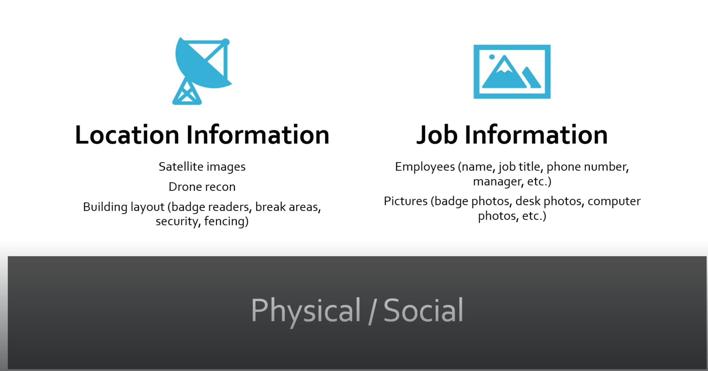

# 📁 Information Gathering

> **Curriculum:** TCM Security — Practical Ethical Hacking (PEH)  
> **Module Description:** Passive and active OSINT, Google Dorking, Subdomain Discovery, Breached Credentials hunting, Hunter.io/Phonebook, Burp Suite passive proxy, and Web Technology profiling.

---

## 🎯 Module Overview & Learning Outcomes
This module provides practical, hands-on methodology and field-tested offensive techniques for **Information Gathering**. 

### 🛠️ Key Tools & Technologies Used
- Specialized exploitation, scanning, and enumeration toolkits.
- Command-line syntax, packet captures, and proof-of-concept demonstrations.
- Defensive detection signatures and hardening strategies.

---

## 📂 Module Topics & Lab Walkthroughs

- 📑 **[Burpsuit](./Burpsuit.md)**
- 📑 **[Discovering Email Addresses](./Discovering_Email_Addresses.md)**
- 📑 **[Google Fu](./Google_Fu.md)**
- 📑 **[Hunting Breached Credentials ](./Hunting_Breached_Credentials.md)**
- 📑 **[Hunting Subdomains 1 & 2](./Hunting_Subdomains_1_2.md)**
- 📑 **[Identifying Web Technologies Used](./Identifying_Web_Technologies_Used.md)**
- 📑 **[Social Media](./Social_Media.md)**

---

## 📝 Core Module Documentation & Notes

Passive Reconnaissance

*Figure: Lab Execution Screenshot / Proof of Exploit*

- 📄 **[Discovering Email Addresses](./Discovering_Email_Addresses.md)**- 📄 **[Hunting Breached Credentials ](./Hunting_Breached_Credentials.md)**- 📄 **[Hunting Subdomains 1 & 2](./Hunting_Subdomains_1_2.md)**- 📄 **[Identifying Web Technologies Used](./Identifying_Web_Technologies_Used.md)**- 📄 **[Burpsuit](./Burpsuit.md)**- 📄 **[Google Fu](./Google_Fu.md)**- 📄 **[Social Media](./Social_Media.md)**

---
[⬅ Back to Master Course Index](../README.md)
