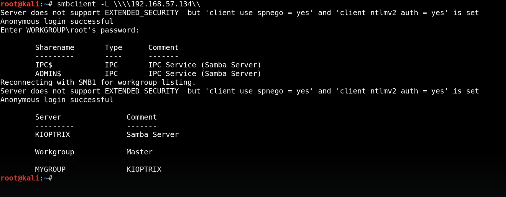

# Enumerating SMB

We to try to connect with the smb
We will use metaspolit for this

First we scan for the version info
using

Use smbclient to connect to the client

try to gain access to the sharenames(mentioned in the result above) if posiible directly

---
[Back to Scanning and enumeration](./README.md)
