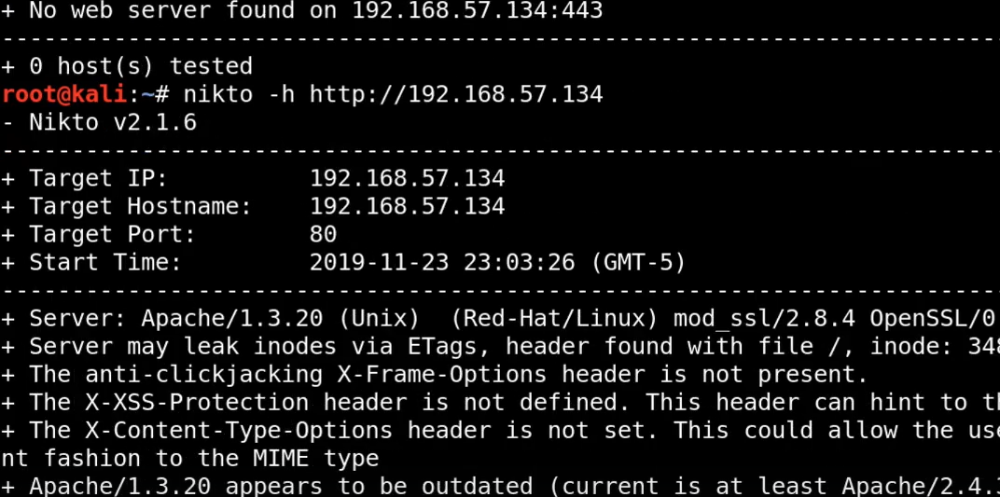

# 🛡️ Enumerating http and https  Part 1 & 2

> **Course:** [Practical Ethical Hacking](../../README.md)  
> **Module:** [Scanning and enumeration](./README.md)  
> **Navigation Path:** `Practical Ethical Hacking > Scanning and enumeration > Enumerating http and https  Part 1 & 2`

---

## 🎯 Executive Summary & Technical Objectives
This document details the practical methodology, tooling, exploitation chain, and defensive remediation for **Enumerating http and https  Part 1 & 2** as conducted in the TCM Security lab environment.

---

## 🔬 Hands-On Walkthrough & Technical Evidence

Go to web page and see if there you can find any vulneribility just by looking the website 

nikto is a vulnerabilty scanner. It is detected easily and scans are stopped if the client is using good security and firewall

*Figure: Lab Execution Screenshot / Proof of Exploit*

copy the output and save to a file. It will be useful

Part 2

We will do directory busting

we can use tools such as dirbuster, dirb or gobuster

Used dirbuster in the vid

we enumerated the full http to check any kind of vulnerabilit which is present and we noted that down

---

## 🛡️ Defensive Hardening & Detection Signatures
- **Monitoring & Auditing:** Enable granular auditing for process creation (Windows Event ID 4688 / Sysmon Event 1) and network connections (Sysmon Event 3).
- **Least Privilege:** Enforce strict principle of least privilege across user accounts and service configurations.
- **Continuous Validation:** Conduct routine vulnerability scanning and automated configuration reviews to identify drift.

---
[⬅ Back to Scanning and enumeration](./README.md) • [🏠 Master Course Index](../README.md)
