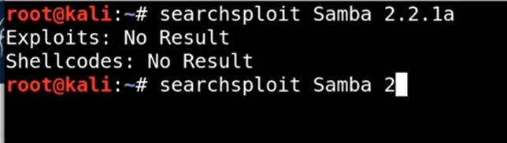

# Researching potential vulnerabilities

All the enumeration you have done until now, its time to search for the vulnerabilites of them, ryt now not using just searching and noting down

Can search exploit by google search
syntax: {version} exploit

Can use searchsploit as well
Tip: do not be too specific with searchsploit as it searches the direct string which you type, c the result below and choose the second one

---
[Back to Scanning and enumeration](./README.md)
