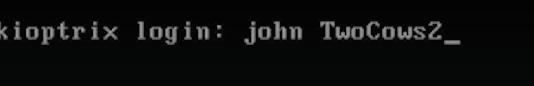

# Scanning & Nmap

Some issues happened with the box, so the login was provided directly

By using the following command we check all the devices on the network using arp 

Nmap

-sS (stealt scan)  (SYN SYN-ACK RST) (can be detected if the target has good security)

-T4 (this is used to determine the speed, T1 is really slow and T5 is really fst, T5 may miss some packets because its too fst)

-p- all pots
If we do not mention any ports nmap will scan the top 1000 ports which are most common
Whenn scanning its always a good idea to scan alll the ports

-A this scans for everything (version info, os info etc) combination of (-sV , -sC, -O and traceroute)

-sU this a udp scan, udp takes long time to scan so usualy just scan the top 1000 

Next step is to check the version info and see if there are in vulnerabilities present for them

---
[Back to Scanning and enumeration](./README.md)
