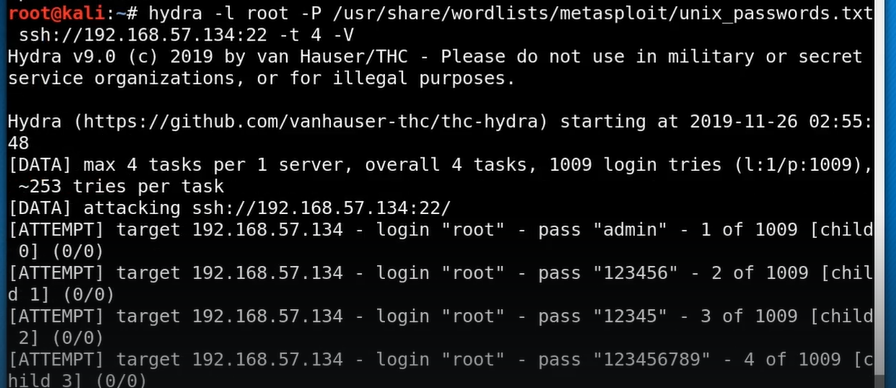
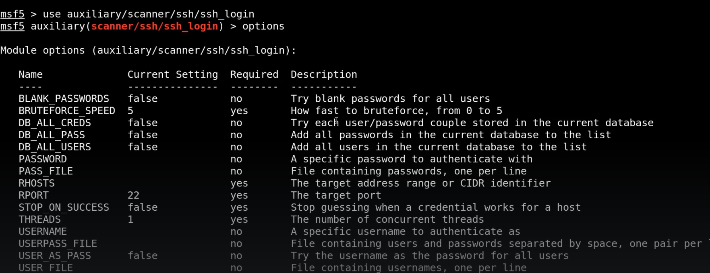

# 🛡️ Brute forcing 

> **Course:** [Practical Ethical Hacking](../../README.md)  
> **Module:** [Exploitation basics](./README.md)  
> **Navigation Path:** `Practical Ethical Hacking > Exploitation basics > Brute forcing `

---

## 🎯 Executive Summary & Technical Objectives
This document details the practical methodology, tooling, exploitation chain, and defensive remediation for **Brute forcing ** as conducted in the TCM Security lab environment.

---

## 🔬 Hands-On Walkthrough & Technical Evidence

If we see an ssh port open on a pentest accesment we wil brute force it to c
1. Check password strength1. See if we are detected 1. Check if we can get in with a weak password
For brute force in this we will use hydra

*Figure: Lab Execution Screenshot / Proof of Exploit*

We will use metasploit as well

*Figure: Lab Execution Screenshot / Proof of Exploit*

Do not worry if you cant crack the password evn heath could not using bruteforce

---

## 🛡️ Defensive Hardening & Detection Signatures
- **Monitoring & Auditing:** Enable granular auditing for process creation (Windows Event ID 4688 / Sysmon Event 1) and network connections (Sysmon Event 3).
- **Least Privilege:** Enforce strict principle of least privilege across user accounts and service configurations.
- **Continuous Validation:** Conduct routine vulnerability scanning and automated configuration reviews to identify drift.

---
[⬅ Back to Exploitation basics](./README.md) • [🏠 Master Course Index](../README.md)
