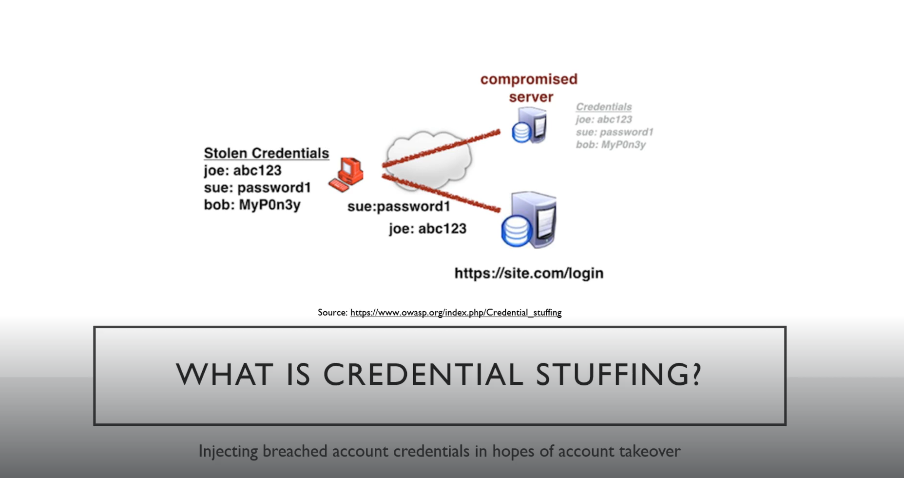

# Credential stuffing and password sniffing

You get these credentials from leaks. Like linkedin leaks

In this he attacked tesla website (do not attack in future scope may change)
Used Burp Suite
He had 2 sets one of usernames and other of passwords so he used the pitchfork attack in intruder

Then we did password spraying using sniper of burp

---
[Back to Exploitation basics](./README.md)
