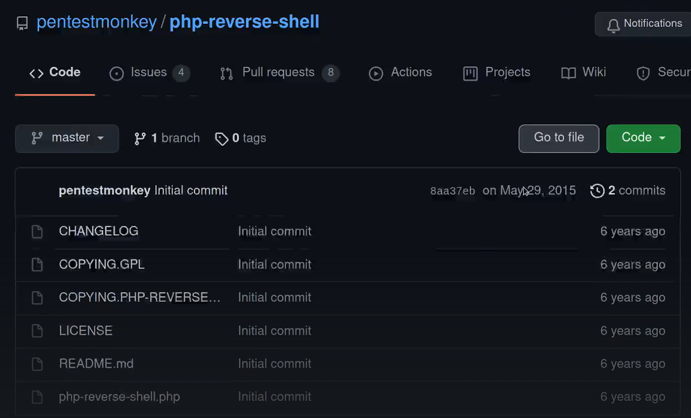
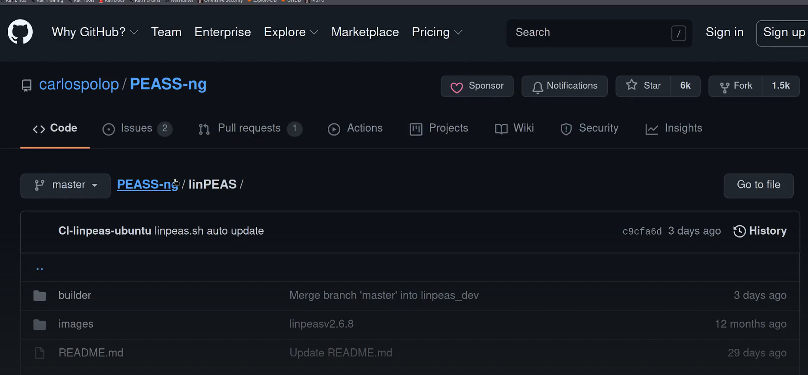
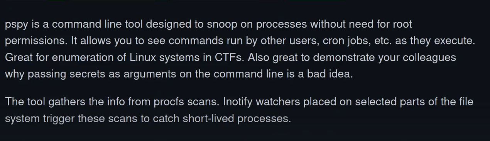

# Academy

username : root
password : tcm

root@academy : dhclient

ssh mostly attack as bruteforce in a pentest to c

Gonna use hashcat to crack hash password

Use dirb or ffuf to find other directories

open academy

upload reverse shell

After getting shell allivate your privilages

Set up a python http server

go to temp directory on the shell which you got and wget the file to allivate privilage

if we want validation that a cronjob is running and we are not getting it with the basic commands use pspy
download the pspy64 bit on your deive and then run it on the target machine

- [My attempt](./My_attempt.md)

---
[Back to New capstone](./README.md)
