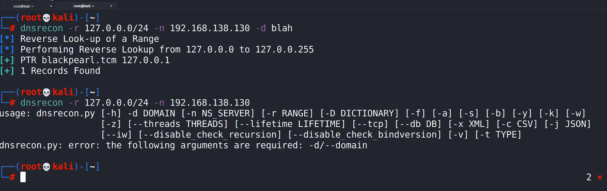
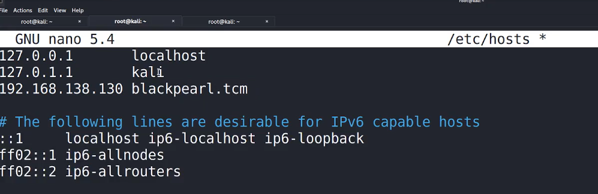
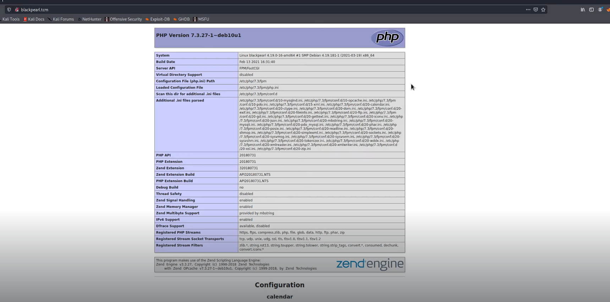
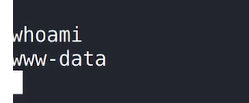
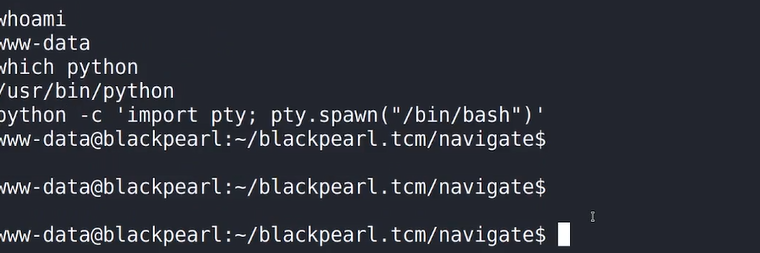

# 🛡️ Blackpearl

> **Course:** [Practical Ethical Hacking](../../README.md)  
> **Module:** [New capstone](./README.md)  
> **Navigation Path:** `Practical Ethical Hacking > New capstone > Blackpearl`

---

## 🎯 Executive Summary & Technical Objectives
This document details the practical methodology, tooling, exploitation chain, and defensive remediation for **Blackpearl** as conducted in the TCM Security lab environment.

---

## 🔬 Hands-On Walkthrough & Technical Evidence

check the pg source code 
directory busting

*Figure: Lab Execution Screenshot / Proof of Exploit*

use -d otherwise won't work

*Figure: Lab Execution Screenshot / Proof of Exploit*

We do this to say that balckpeal allocates to that ip address then dns will do its magic

close and open the site on the browser again 

*Figure: Lab Execution Screenshot / Proof of Exploit*

do directory busting again using ffuf but this time use the name of the website which you saved in etc hosts 

type navigate cms exploit on google
Trying metasploit in vid can do manual as well
use metaspolit and again shell on meterpreter
Hav to do privilage escalation now

We got the shell but we can now c username@machinename $ (shell)

*Figure: Lab Execution Screenshot / Proof of Exploit*

tty shell can be used 
can google that

*Figure: Lab Execution Screenshot / Proof of Exploit*

use linpeas to check for privilage escalation

u will find something interesting in SUID 
use the gtfopen to find ways to escalate privilages

### 🎯 Vulnerability & Exploit Analysis: Navigate CMS Unauthenticated RCE
- **Attack Chain:**
  1. **VHost / DNS Routing:** Analyzed `phpinfo()` on port 80; identified internal domain name `blackpearl.tcm`.
  2. **Navigate CMS Exploitation:** Discovered Navigate CMS instance; exploited unauthenticated arbitrary file upload in `navigate_upload.php` to upload PHP web shell.
  3. **Privilege Escalation:** Executed `find / -perm -u=s -type f 2>/dev/null`; identified SUID bit set on `/usr/bin/php7.3`. Executed `php -r "pcntl_exec('/bin/sh', ['-p']);"` to escalate directly to `root`.
- **Remediation & Hardening:**
  1. Restrict write permissions on web upload directories; disable PHP execution inside uploads.
  2. Remove unnecessary SUID permissions from binary utilities.

---

## 🛡️ Defensive Hardening & Detection Signatures
- **Monitoring & Auditing:** Enable granular auditing for process creation (Windows Event ID 4688 / Sysmon Event 1) and network connections (Sysmon Event 3).
- **Least Privilege:** Enforce strict principle of least privilege across user accounts and service configurations.
- **Continuous Validation:** Conduct routine vulnerability scanning and automated configuration reviews to identify drift.

---
[⬅ Back to New capstone](./README.md) • [🏠 Master Course Index](../README.md)
