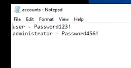
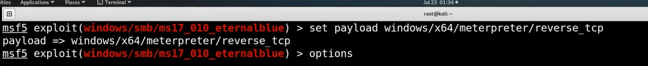
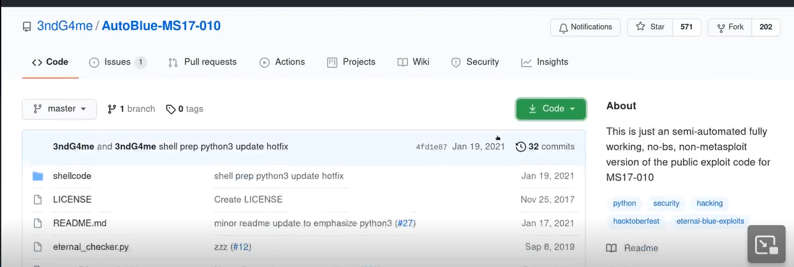
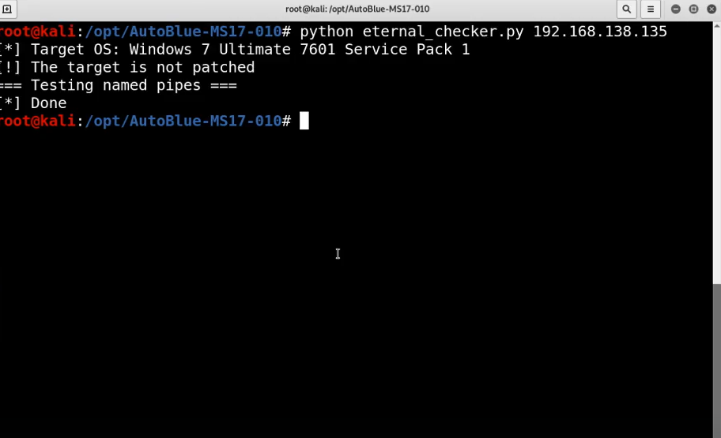

# 🛡️ Blue

> **Course:** [Practical Ethical Hacking](../../README.md)  
> **Module:** [New capstone](./README.md)  
> **Navigation Path:** `Practical Ethical Hacking > New capstone > Blue`

---

## 🎯 Executive Summary & Technical Objectives
This document details the practical methodology, tooling, exploitation chain, and defensive remediation for **Blue** as conducted in the TCM Security lab environment.

---

## 🔬 Hands-On Walkthrough & Technical Evidence

Note all findigns

*Figure: Lab Execution Screenshot / Proof of Exploit*

Following i wil just list down the walkthorugh
Do an nmap scan
Seach the smb exploit
use msf auxilariy scanner for smb 
Always set the payload to  64 bit

*Figure: Lab Execution Screenshot / Proof of Exploit*

the x64 is a reference for 64 bit (additonal info if uk that the system is 32 bits set to 32 bits)
Run the exploit (sometimes it might not work in the first 3-5 runs)
Now for manual exploitaion search git hub and exploit db
heath used

*Figure: Lab Execution Screenshot / Proof of Exploit*

*Figure: Lab Execution Screenshot / Proof of Exploit*

if you set up evrything and run this wil probably brk the system and restart it
give it a try if you wnt 

- 📄 **[My attempt](./My_attempt.md)**

### 🎯 Vulnerability & Exploit Analysis: MS17-010 (EternalBlue)
- **CVE:** CVE-2017-0143 / MS17-010
- **Severity:** Critical (CVSS 9.8)
- **Vulnerability Mechanism:** Buffer overflow in Microsoft Server Message Block 1.0 (SMBv1) handling of specially crafted `SrvOs2FeaToNt` requests.
- **Offensive Execution:** Exploited via Metasploit `exploit/windows/smb/ms17_010_eternalblue` or manual Python exploit (`zzz_exploit.py`) to execute shellcode directly inside the `SYSTEM` context without credentials.
- **Remediation & Hardening:**
  1. Apply Microsoft Security Bulletin MS17-010.
  2. Disable SMBv1 across the network via PowerShell: `Disable-WindowsOptionalFeature -Online -FeatureName SMB1Protocol`.
  3. Restrict inbound port 445 on perimeter firewalls.

---

## 🛡️ Defensive Hardening & Detection Signatures
- **Monitoring & Auditing:** Enable granular auditing for process creation (Windows Event ID 4688 / Sysmon Event 1) and network connections (Sysmon Event 3).
- **Least Privilege:** Enforce strict principle of least privilege across user accounts and service configurations.
- **Continuous Validation:** Conduct routine vulnerability scanning and automated configuration reviews to identify drift.

---
[⬅ Back to New capstone](./README.md) • [🏠 Master Course Index](../README.md)
