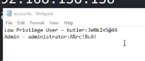
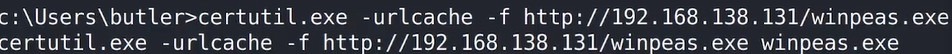
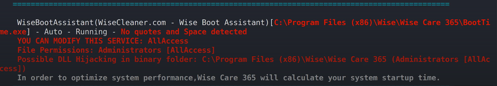
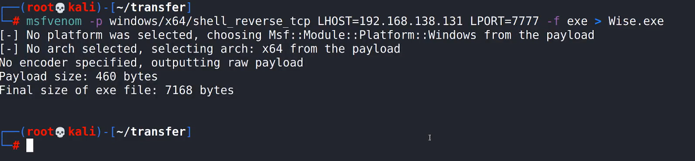

# 🛡️ Butler

> **Course:** [Practical Ethical Hacking](../../README.md)  
> **Module:** [New capstone](./README.md)  
> **Navigation Path:** `Practical Ethical Hacking > New capstone > Butler`

---

## 🎯 Executive Summary & Technical Objectives
This document details the practical methodology, tooling, exploitation chain, and defensive remediation for **Butler** as conducted in the TCM Security lab environment.

---

## 🔬 Hands-On Walkthrough & Technical Evidence

*Figure: Lab Execution Screenshot / Proof of Exploit*

This machine will help us escalate privilages in windows

search for jenkins exploit (check if can exploit, lot of exploitations are there )
Check if default credentials works google for it
Can do brute force directory busting (won't work but good methodology to hav)

In vid - brute force login using brupsuit using cluster bomb (jenkins:jenkins)

Grovy exploit search on git n then copy paste on script console in jenkins 
Set up a listener using nc 
Download winpeas x64
to bring it to target machine

*Figure: Lab Execution Screenshot / Proof of Exploit*

Lot of interesting things will be found but use the following one

*Figure: Lab Execution Screenshot / Proof of Exploit*

Since there are no quotes it won't take the direct path( basically it will check for .exe after every space detected)

Use msfvenom  to generate a payload

*Figure: Lab Execution Screenshot / Proof of Exploit*

Use certutil to transfer it 
If you run it directly it's not use because you wil gain access as normal user not admin
To gain access for admin stop the server first and the restart

Use command 
sc stop 
sc start

### 🎯 Vulnerability & Exploit Analysis: Jenkins CI/CD Unauthenticated RCE
- **Attack Chain:**
  1. **Service Recon:** Identified Jenkins HTTP service running on non-standard port 8080.
  2. **Script Console Abuse:** Accessed Jenkins Groovy Script Console (`/script`) without authentication.
  3. **Reverse Shell Execution:** Executed Groovy payload (or PowerShell Nishang reverse shell script) to spawn interactive shell as `butler`.
  4. **Windows Privilege Escalation:** Enumerated unquoted service paths and weak file permissions on local services to replace executable and elevate to `NT AUTHORITY\SYSTEM`.
- **Remediation & Hardening:**
  1. Enforce Role-Based Access Control (RBAC) on Jenkins; disable anonymous access.
  2. Secure Windows service paths by wrapping paths in quotes in registry `HKLM\SYSTEM\CurrentControlSet\Services`.

---

## 🛡️ Defensive Hardening & Detection Signatures
- **Monitoring & Auditing:** Enable granular auditing for process creation (Windows Event ID 4688 / Sysmon Event 1) and network connections (Sysmon Event 3).
- **Least Privilege:** Enforce strict principle of least privilege across user accounts and service configurations.
- **Continuous Validation:** Conduct routine vulnerability scanning and automated configuration reviews to identify drift.

---
[⬅ Back to New capstone](./README.md) • [🏠 Master Course Index](../README.md)
