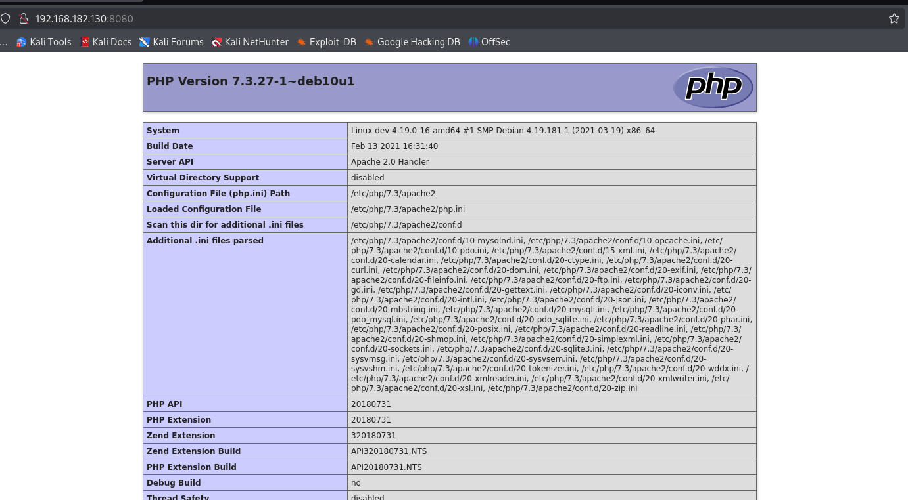
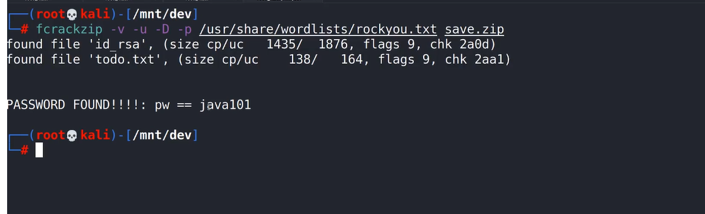
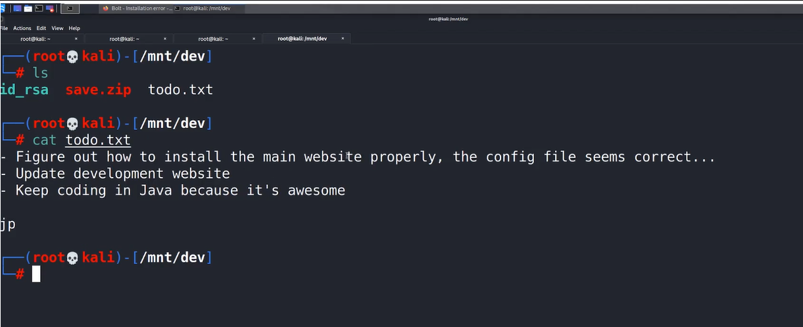
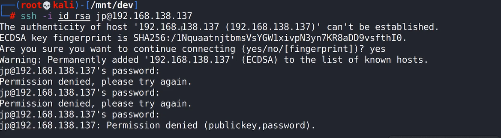
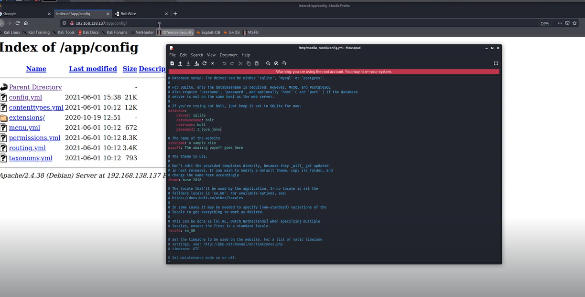

# 🛡️ Dev

> **Course:** [Practical Ethical Hacking](../../README.md)  
> **Module:** [New capstone](./README.md)  
> **Navigation Path:** `Practical Ethical Hacking > New capstone > Dev`

---

## 🎯 Executive Summary & Technical Objectives
This document details the practical methodology, tooling, exploitation chain, and defensive remediation for **Dev** as conducted in the TCM Security lab environment.

---

## 🔬 Hands-On Walkthrough & Technical Evidence

target_ip : 192.168.182.130

22/tcp    open  ssh      OpenSSH 7.9p1 Debian 10+deb10u2 (protocol 2.0)

80/tcp    open  http     Apache httpd 2.4.38 ((Debian))

111/tcp   open  rpcbind  2-4 (RPC #100000)

2049/tcp  open  nfs      3-4 (RPC #100003)

8080/tcp  open  http     Apache httpd 2.4.38 ((Debian))
|_http-title: PHP 7.3.27-1~deb10u1 - phpinfo()
|_http-server-header: Apache/2.4.38 (Debian)
| http-open-proxy: Potentially OPEN proxy.
|_Methods supported:CONNECTION

Discovered on port 8080

*Figure: Lab Execution Screenshot / Proof of Exploit*

use ffuf to enumerate directories on both http ports
finding directory listing can be a finding
connected to the nfs server
used showmount 
then mount (somehow i couldn't do it)
used fcrackzip to crack the password of the zip file got from the nfs server

*Figure: Lab Execution Screenshot / Proof of Exploit*

*Figure: Lab Execution Screenshot / Proof of Exploit*

The id_rsa file can be used to connect through ssh

*Figure: Lab Execution Screenshot / Proof of Exploit*

After enumeration of directories o and check them 

*Figure: Lab Execution Screenshot / Proof of Exploit*

search for boltwire exploit
focus on LFI

Use gtfo bins site to look at various escalation techniques

### 🎯 Vulnerability & Exploit Analysis: Boltwire CMS LFI & NFS Abuse
- **Attack Chain:**
  1. **NFS Share Enumeration:** Discovered exported share on port 2049 via `showmount -e 192.168.182.130`.
  2. **Zip Password Cracking:** Mounted share, extracted password-protected backup zip using `fcrackzip -u -D -p /usr/share/wordlists/rockyou.txt save.zip`.
  3. **SSH Foothold:** Extracted `id_rsa` private key to gain user-level shell access over port 22.
  4. **LFI in Boltwire:** Local File Inclusion vulnerability exploited via parameter manipulation to read sensitive system configuration files.
  5. **Privilege Escalation:** SUID / GTFOBins exploitation on misconfigured binary to gain full `root` privileges.
- **Remediation & Hardening:**
  1. Restrict NFS exports in `/etc/exports` with `root_squash` and IP subnet binding.
  2. Enforce strong SSH key passphrases and remove unused SUID bits (`chmod u-s /path/to/binary`).
  3. Upgrade Boltwire CMS and sanitize input parameters against path traversal.

---

## 🛡️ Defensive Hardening & Detection Signatures
- **Monitoring & Auditing:** Enable granular auditing for process creation (Windows Event ID 4688 / Sysmon Event 1) and network connections (Sysmon Event 3).
- **Least Privilege:** Enforce strict principle of least privilege across user accounts and service configurations.
- **Continuous Validation:** Conduct routine vulnerability scanning and automated configuration reviews to identify drift.

---
[⬅ Back to New capstone](./README.md) • [🏠 Master Course Index](../README.md)
