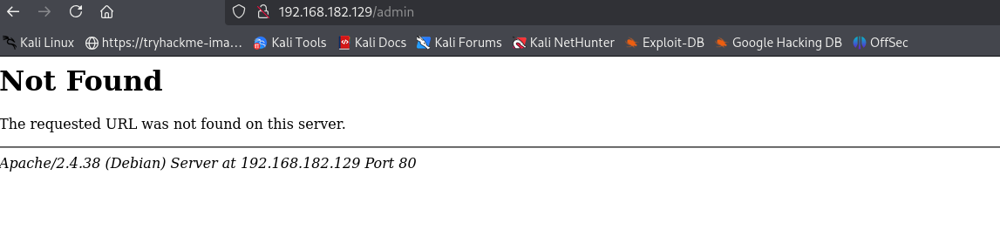
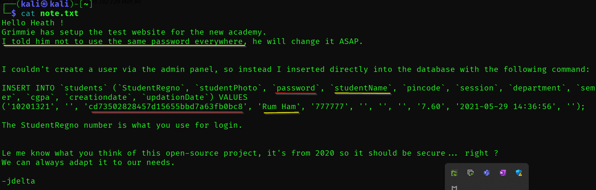
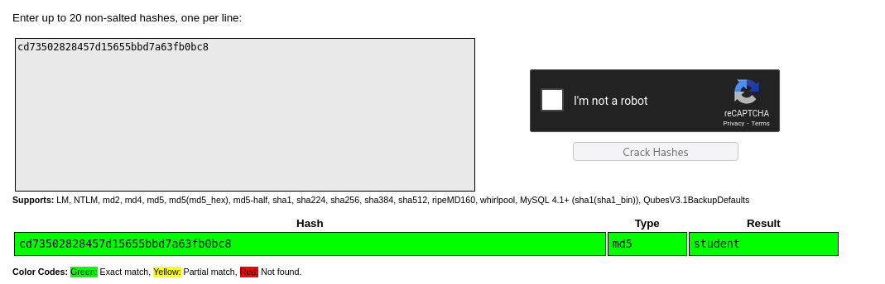

# 🛡️ My attempt

> **Course:** [Practical Ethical Hacking](../../README.md)  
> **Module:** [New capstone](./README.md)  
> **Navigation Path:** `Practical Ethical Hacking > New capstone > My attempt`

---

## 🎯 Executive Summary & Technical Objectives
This document details the practical methodology, tooling, exploitation chain, and defensive remediation for **My attempt** as conducted in the TCM Security lab environment.

---

## 🔬 Hands-On Walkthrough & Technical Evidence

192.168.182.129/24

21/tcp open  ftp     vsftpd 3.0.3

22/tcp open  ssh     OpenSSH 7.9p1 Debian 10+deb10u2 (protocol 2.0)

Apache httpd 2.4.38 ((Debian))

*Figure: Lab Execution Screenshot / Proof of Exploit*

Version information displayed during error

Connected using ftp

read the file

*Figure: Lab Execution Screenshot / Proof of Exploit*

Password in hash : cd73502828457d15655bbd7a63fb0bc8
Used [https://crackstation.net/](https://crackstation.net/) to crack the hashed password

*Figure: Lab Execution Screenshot / Proof of Exploit*

Password : student

used ffuf to do directory busting 

went to academy and logged in

Found that the upload img was not validated correctly 

Downloaded a reverse shel

got shell on target but no sudo privilage

now to escalate privilage i downloaded [linpeas.sh](http://linpeas.sh/) amd thn host a python http server

---

## 🛡️ Defensive Hardening & Detection Signatures
- **Monitoring & Auditing:** Enable granular auditing for process creation (Windows Event ID 4688 / Sysmon Event 1) and network connections (Sysmon Event 3).
- **Least Privilege:** Enforce strict principle of least privilege across user accounts and service configurations.
- **Continuous Validation:** Conduct routine vulnerability scanning and automated configuration reviews to identify drift.

---
[⬅ Back to New capstone](./README.md) • [🏠 Master Course Index](../README.md)
