# 📁 Active Directory Overview

> **Curriculum:** TCM Security — Practical Ethical Hacking (PEH)  
> **Module Description:** Active Directory architecture, Domain Controllers, Trees, Forests, Trusts, LDAP, and Kerberos ticket-granting authentication flow.

---

## 🎯 Module Overview & Learning Outcomes
This module provides practical, hands-on methodology and field-tested offensive techniques for **Active Directory Overview**. 

### 🛠️ Key Tools & Technologies Used
- Specialized exploitation, scanning, and enumeration toolkits.
- Command-line syntax, packet captures, and proof-of-concept demonstrations.
- Defensive detection signatures and hardening strategies.

---

## 📝 Core Module Documentation & Notes

Very important to know for internal penetration test

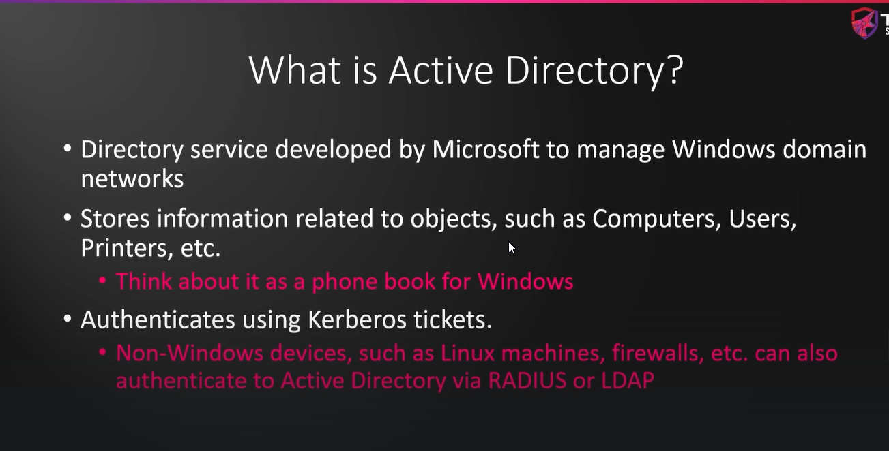
*Figure: Lab Execution Screenshot / Proof of Exploit*

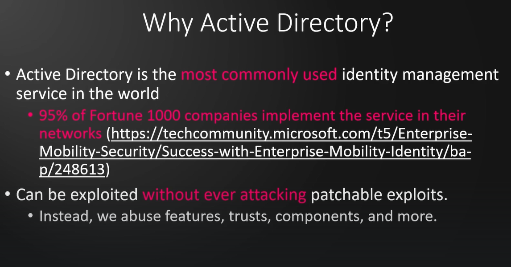
*Figure: Lab Execution Screenshot / Proof of Exploit*

Active directory components

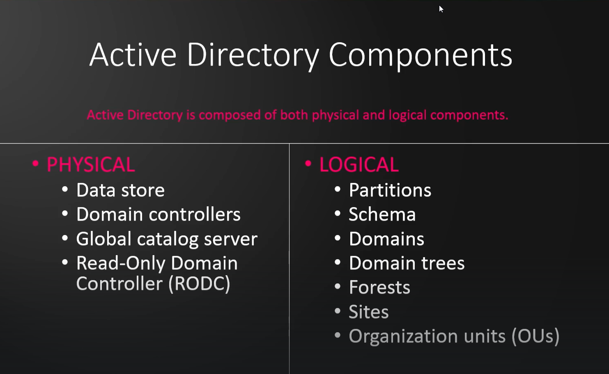
*Figure: Lab Execution Screenshot / Proof of Exploit*

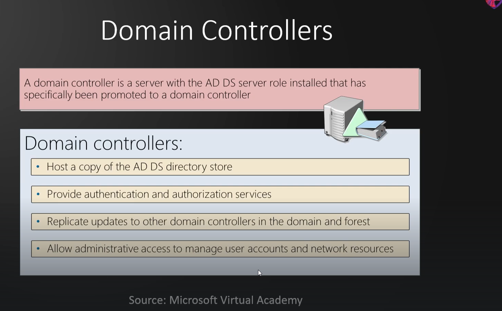
*Figure: Lab Execution Screenshot / Proof of Exploit*

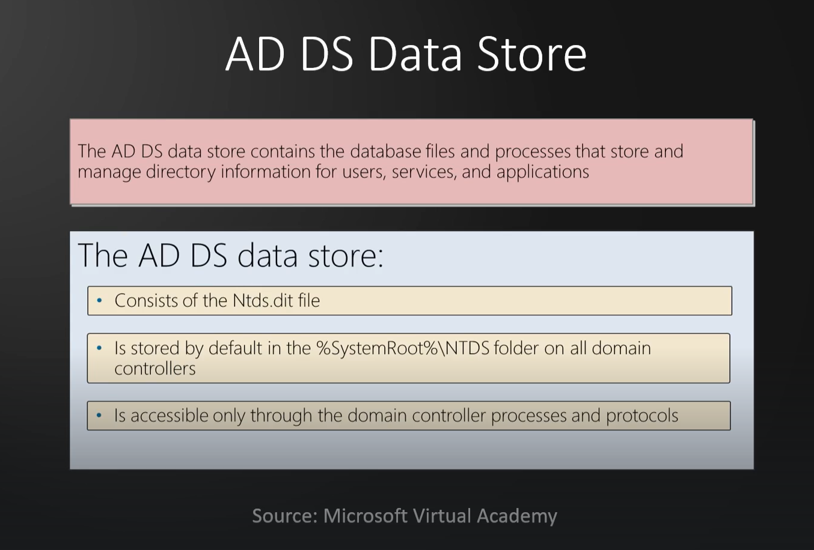
*Figure: Lab Execution Screenshot / Proof of Exploit*

Logical Components

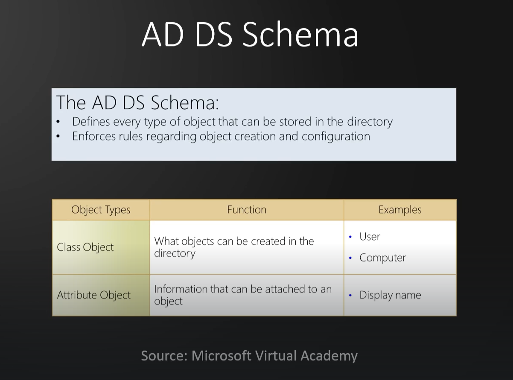
*Figure: Lab Execution Screenshot / Proof of Exploit*

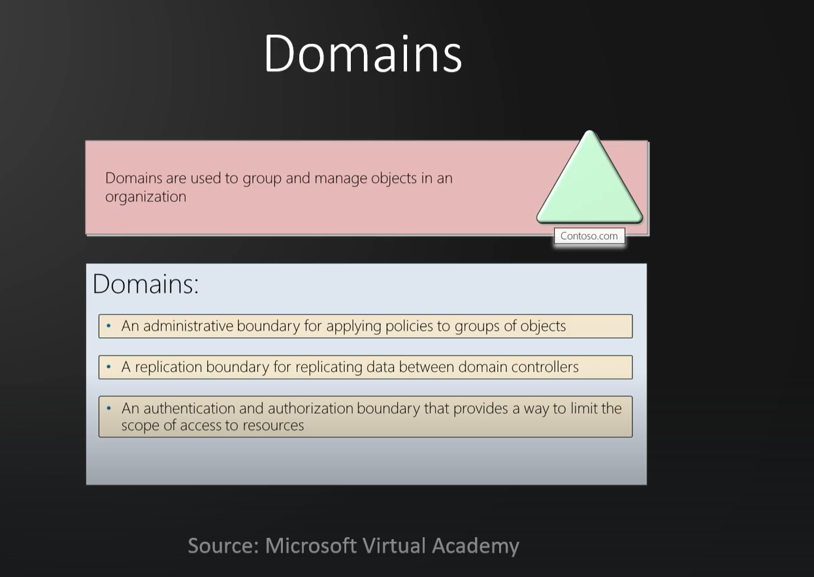
*Figure: Lab Execution Screenshot / Proof of Exploit*

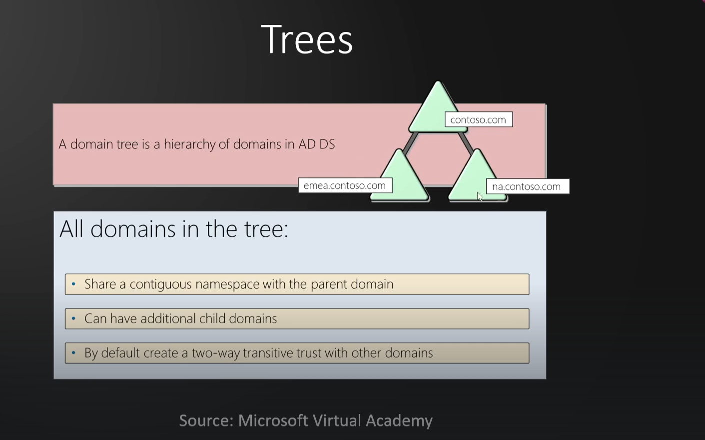
*Figure: Lab Execution Screenshot / Proof of Exploit*

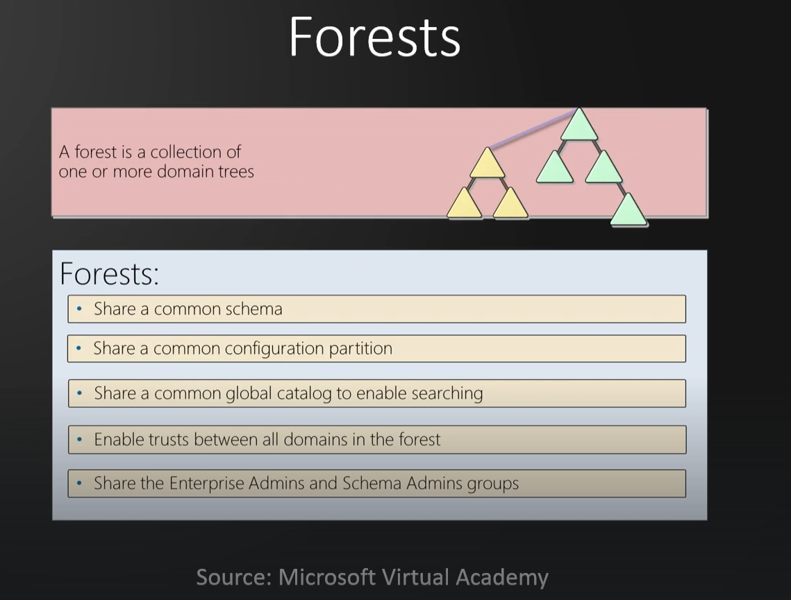
*Figure: Lab Execution Screenshot / Proof of Exploit*

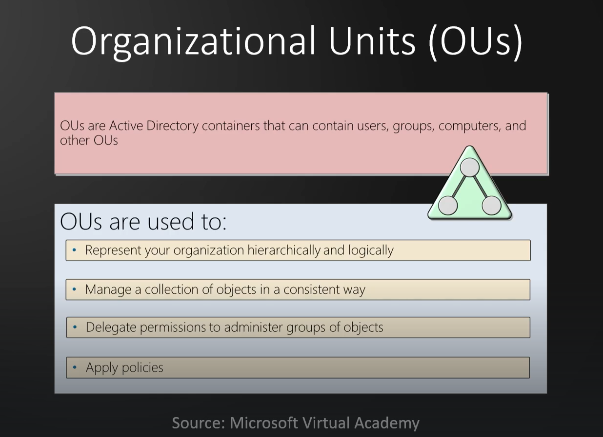
*Figure: Lab Execution Screenshot / Proof of Exploit*

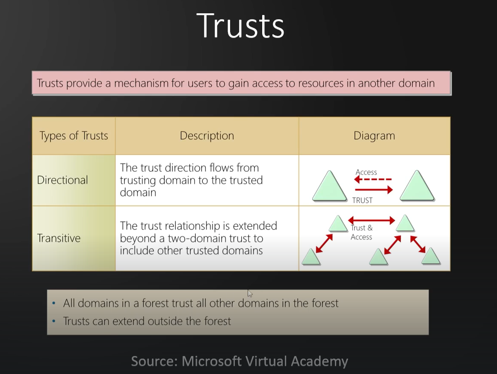
*Figure: Lab Execution Screenshot / Proof of Exploit*

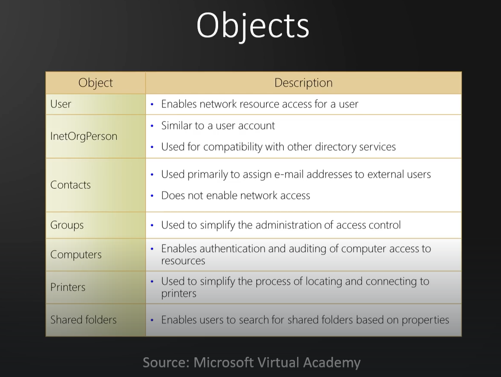
*Figure: Lab Execution Screenshot / Proof of Exploit*

---
[⬅ Back to Master Course Index](../README.md)
