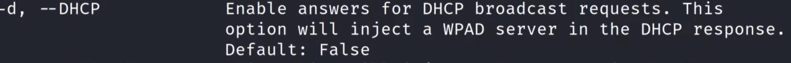
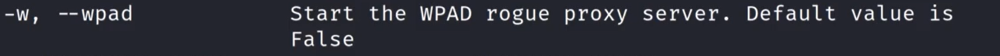
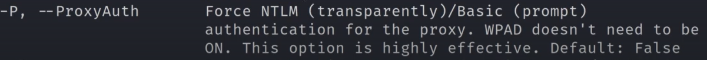
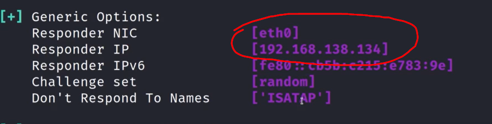
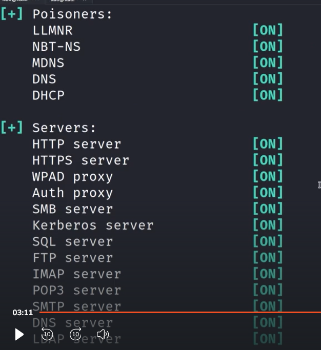
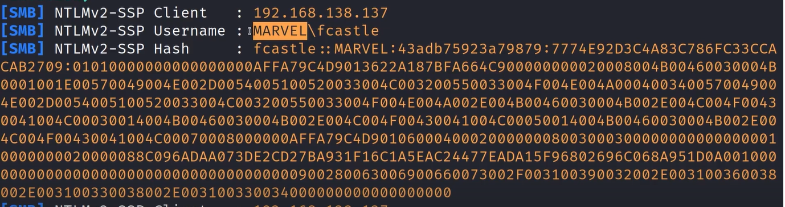

# 🛡️ Capturing Hashes with Responder

> **Course:** [Practical Ethical Hacking](../../README.md)  
> **Module:** [Attacking Active Directory: Initial Attack Vectors](./README.md)  
> **Navigation Path:** `Practical Ethical Hacking > Attacking Active Directory: Initial Attack Vectors > Capturing Hashes with Responder`

---

## 🎯 Executive Summary & Technical Objectives
This document details the practical methodology, tooling, exploitation chain, and defensive remediation for **Capturing Hashes with Responder** as conducted in the TCM Security lab environment.

---

## 🔬 Hands-On Walkthrough & Technical Evidence

Best time to run responder is early in the morning before everyone logs in
Responder needs to be ran with sudo or as root

sudo responder -I eth0 -dwPv 

-I is probably for ip address

*Figure: Lab Execution Screenshot / Proof of Exploit*

*Figure: Lab Execution Screenshot / Proof of Exploit*

*Figure: Lab Execution Screenshot / Proof of Exploit*

-v for increased verbosity

After running, always make sure to check if your ip matches and is correct

*Figure: Lab Execution Screenshot / Proof of Exploit*

Make sure that all of the following are on

*Figure: Lab Execution Screenshot / Proof of Exploit*

Tried to gain access to the attacker ip simply to generate traffic 

got the ntlm hash

*Figure: Lab Execution Screenshot / Proof of Exploit*

---

## 🛡️ Defensive Hardening & Detection Signatures
- **Monitoring & Auditing:** Enable granular auditing for process creation (Windows Event ID 4688 / Sysmon Event 1) and network connections (Sysmon Event 3).
- **Least Privilege:** Enforce strict principle of least privilege across user accounts and service configurations.
- **Continuous Validation:** Conduct routine vulnerability scanning and automated configuration reviews to identify drift.

---
[⬅ Back to Attacking Active Directory: Initial Attack Vectors](./README.md) • [🏠 Master Course Index](../README.md)
