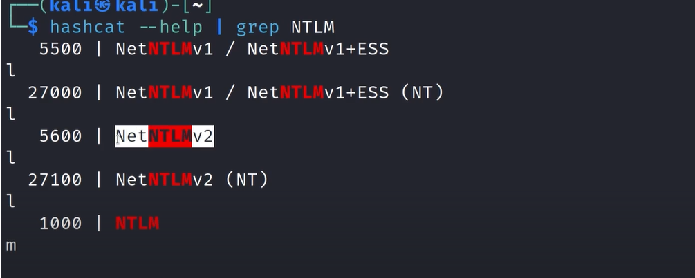
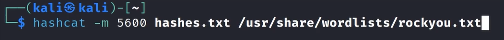

# Cracking Our Captured Hashes

Copy the hash in a file to use in hashcat
Another tool you can use is John the reaper
It is not ideal to crack hashes on the vm
Since to crack hashes it uses the gpu so its better to run it on base os 

we can use the  —help | grep with the hash type if we know what hash it is so we can get all the hash module of that ; Below we are using NTLMv2 since the hash type was the sm

---
[Back to Attacking Active Directory: Initial Attack Vectors](./README.md)
