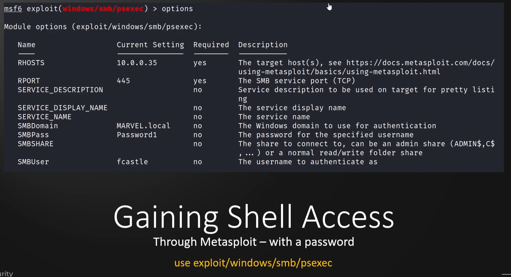
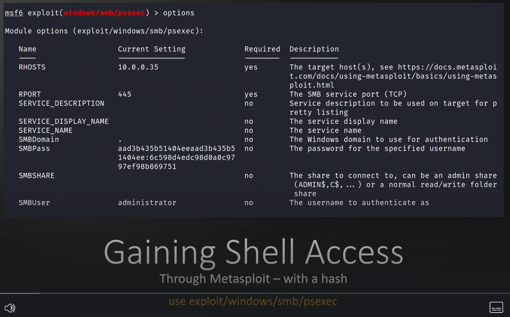
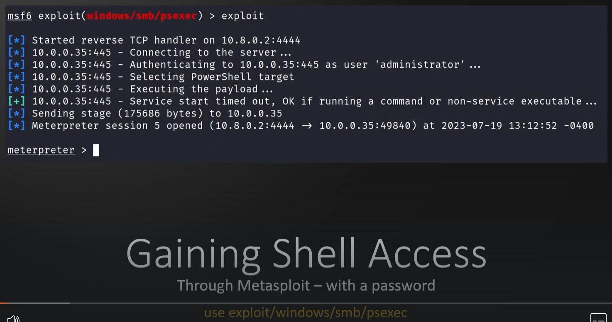
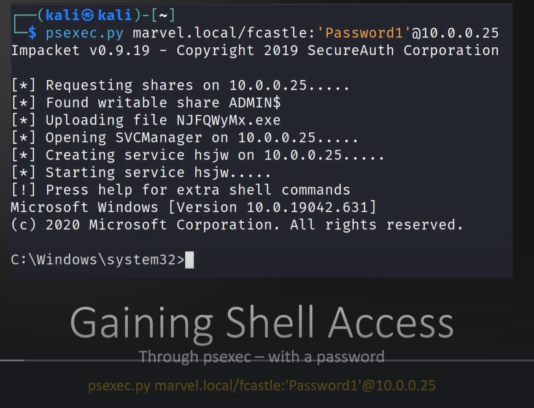
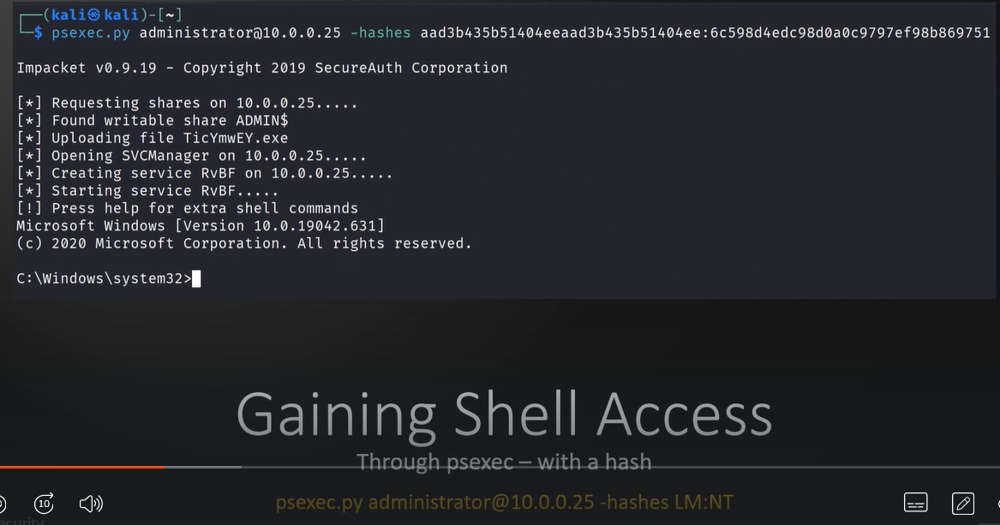
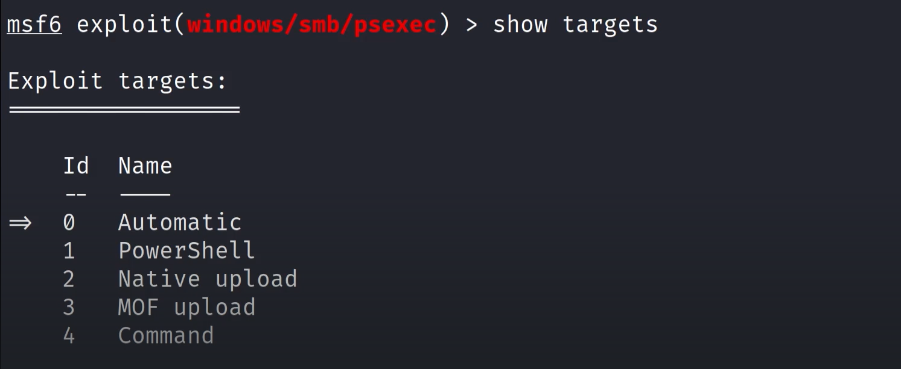

# 🛡️ Gaining a shell

> **Course:** [Practical Ethical Hacking](../../README.md)  
> **Module:** [Attacking Active Directory: Initial Attack Vectors](./README.md)  
> **Navigation Path:** `Practical Ethical Hacking > Attacking Active Directory: Initial Attack Vectors > Gaining a shell`

---

## 🎯 Executive Summary & Technical Objectives
This document details the practical methodology, tooling, exploitation chain, and defensive remediation for **Gaining a shell** as conducted in the TCM Security lab environment.

---

## 🔬 Hands-On Walkthrough & Technical Evidence

Couple of methods to do this

we can use metasploit 
With password

*Figure: Lab Execution Screenshot / Proof of Exploit*

With hash

*Figure: Lab Execution Screenshot / Proof of Exploit*

Metasploit is a bit noisy and in a real time enviroment there is a chance it might get caught

*Figure: Lab Execution Screenshot / Proof of Exploit*

We can use [psexec.py](http://psexec.py/) It wont get detected as much

with password

*Figure: Lab Execution Screenshot / Proof of Exploit*

With hash

*Figure: Lab Execution Screenshot / Proof of Exploit*

Always set the payload to x64 on metasploit

If automatic does not work try the others (Native upload works the best)

*Figure: Lab Execution Screenshot / Proof of Exploit*

---

## 🛡️ Defensive Hardening & Detection Signatures
- **Monitoring & Auditing:** Enable granular auditing for process creation (Windows Event ID 4688 / Sysmon Event 1) and network connections (Sysmon Event 3).
- **Least Privilege:** Enforce strict principle of least privilege across user accounts and service configurations.
- **Continuous Validation:** Conduct routine vulnerability scanning and automated configuration reviews to identify drift.

---
[⬅ Back to Attacking Active Directory: Initial Attack Vectors](./README.md) • [🏠 Master Course Index](../README.md)
