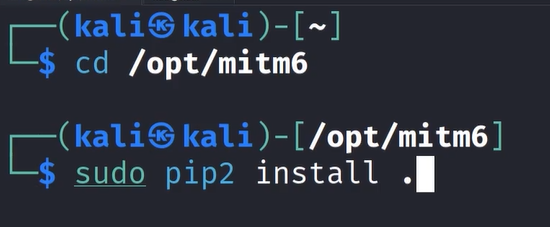
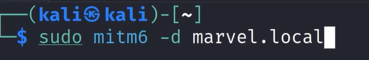
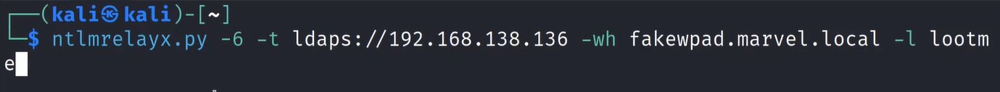

# 🛡️ IPv6 DNS Takeover via mitm6

> **Course:** [Practical Ethical Hacking](../../README.md)  
> **Module:** [Attacking Active Directory: Initial Attack Vectors](./README.md)  
> **Navigation Path:** `Practical Ethical Hacking > Attacking Active Directory: Initial Attack Vectors > IPv6 DNS Takeover via mitm6`

---

## 🎯 Executive Summary & Technical Objectives
This document details the practical methodology, tooling, exploitation chain, and defensive remediation for **IPv6 DNS Takeover via mitm6** as conducted in the TCM Security lab environment.

---

## 🔬 Hands-On Walkthrough & Technical Evidence

Install mitm6

*Figure: Lab Execution Screenshot / Proof of Exploit*

Does not get installed then see youtube or github

Run these attacks only in small sprints if you run it longer than 5-10 mins it might crash the system or will not be able to authenticate people
set up mitm6 n ntlmreplay
run the ntlmrelap first then the mitm6

*Figure: Lab Execution Screenshot / Proof of Exploit*

-d is for the domain

*Figure: Lab Execution Screenshot / Proof of Exploit*

-6 is for ipv6
-t for target
-wh for wpad (WPAD is a protocol that allows devices on a network to automatically discover and configure proxy settings.)
Tht fakewpad is our choice we can put anything there 
-l is for loot it will create a folder

When someone logs in it will create a new user for us 

The new user created will have access to [secretsdump.py](http://secretsdump.py/) and  the group Enterprise admins

---

## 🛡️ Defensive Hardening & Detection Signatures
- **Monitoring & Auditing:** Enable granular auditing for process creation (Windows Event ID 4688 / Sysmon Event 1) and network connections (Sysmon Event 3).
- **Least Privilege:** Enforce strict principle of least privilege across user accounts and service configurations.
- **Continuous Validation:** Conduct routine vulnerability scanning and automated configuration reviews to identify drift.

---
[⬅ Back to Attacking Active Directory: Initial Attack Vectors](./README.md) • [🏠 Master Course Index](../README.md)
