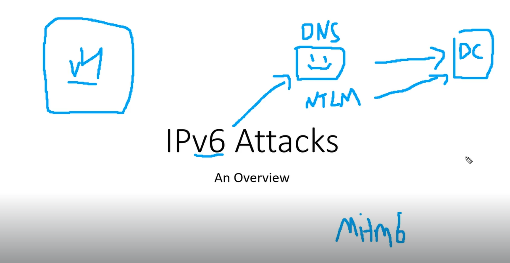

# IPv6 attacks

Mostly on a network no uses ipv6 evn tho it is enabled if that is the case
Attacker can act as the dns and get authentication to the domain controller
When someone logs in and uses their credentials that comes to us in the form of ntlm
Then we do a ldap relay to the domain controller with the ntlm credentials
LDAP stands for Lightweight Directory Access Protocol
We can use the tool man in the middle 6 to create a new accout for us
Very hard to detect as of 2021 

---
[Back to Attacking Active Directory: Initial Attack Vectors](./README.md)
