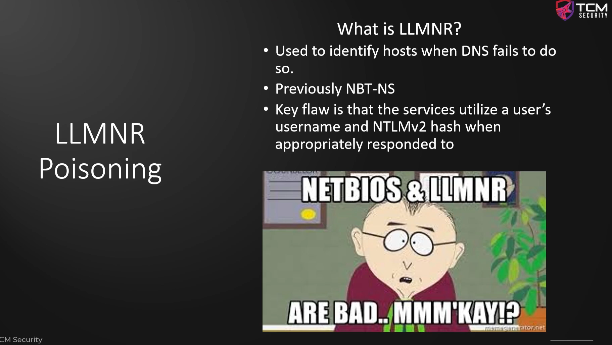
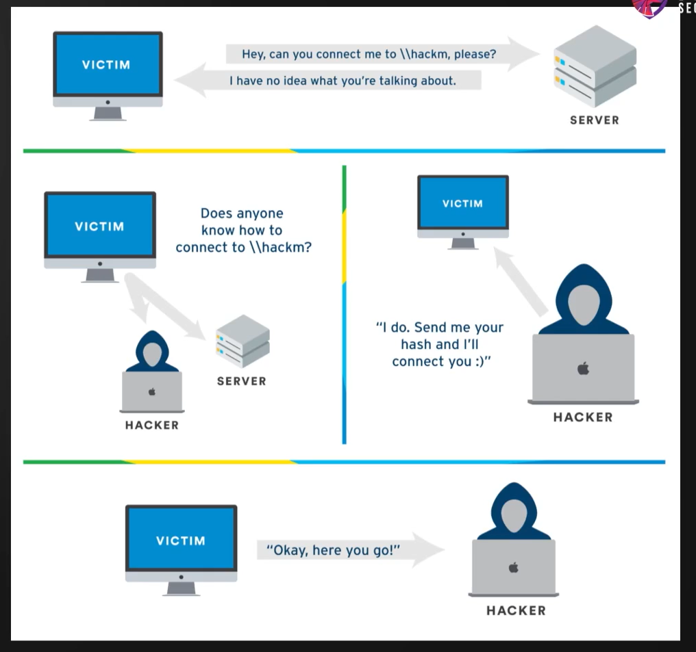
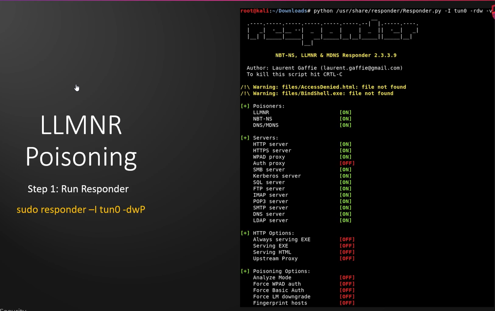
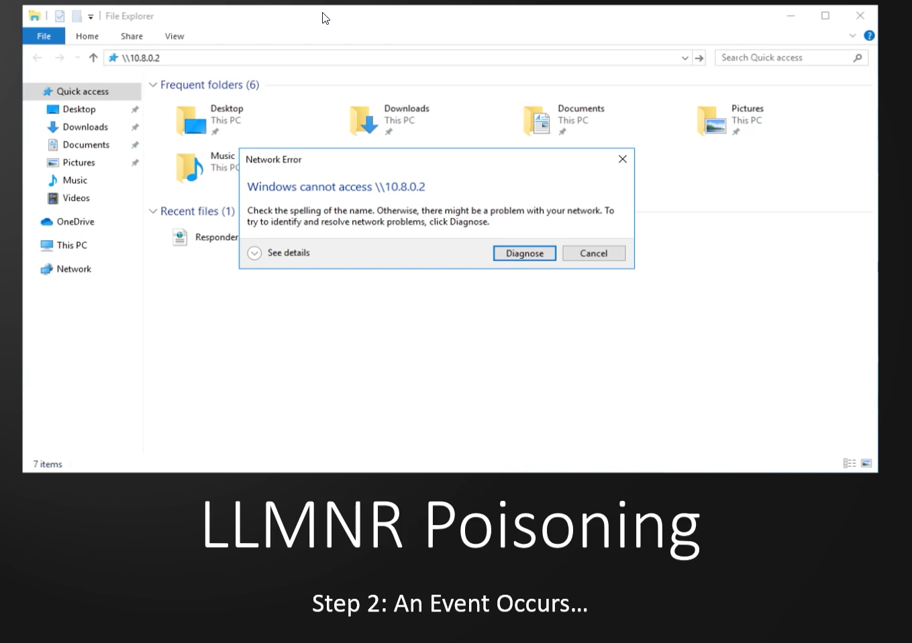
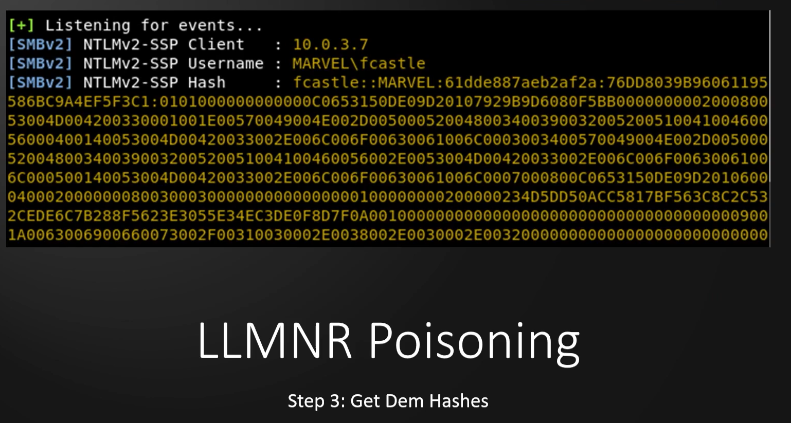
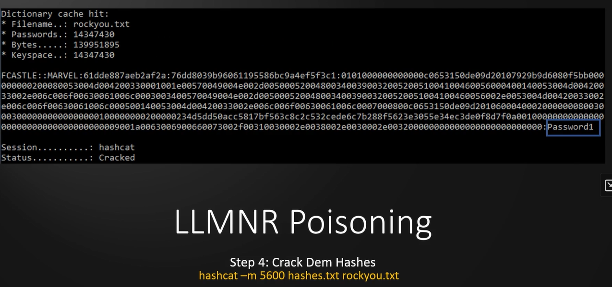

# 🛡️ LLMNR Poisoning Overview

> **Course:** [Practical Ethical Hacking](../../README.md)  
> **Module:** [Attacking Active Directory: Initial Attack Vectors](./README.md)  
> **Navigation Path:** `Practical Ethical Hacking > Attacking Active Directory: Initial Attack Vectors > LLMNR Poisoning Overview`

---

## 🎯 Executive Summary & Technical Objectives
This document details the practical methodology, tooling, exploitation chain, and defensive remediation for **LLMNR Poisoning Overview** as conducted in the TCM Security lab environment.

---

## 🔬 Hands-On Walkthrough & Technical Evidence

Attacking Active Directory: Initial Attack Vectors 

*Figure: Lab Execution Screenshot / Proof of Exploit*

Stands for Link-Local Multicast Name Resolution

Why do we care

When we intercept the traffic we can intercept a username and a hash (this is a type of Man in the middle attack)

Eg. actual machine is \\hackme but the user misspelled 

*Figure: Lab Execution Screenshot / Proof of Exploit*

run responder

*Figure: Lab Execution Screenshot / Proof of Exploit*

It can listen to traffic and grab the hash

try to do to a file share but with wrong thing in the end to direct to responder

*Figure: Lab Execution Screenshot / Proof of Exploit*

When we do the above we can get a hash

*Figure: Lab Execution Screenshot / Proof of Exploit*

If the hash is weak enough we can crack it using hashcat

*Figure: Lab Execution Screenshot / Proof of Exploit*

---

## 🛡️ Defensive Hardening & Detection Signatures
- **Monitoring & Auditing:** Enable granular auditing for process creation (Windows Event ID 4688 / Sysmon Event 1) and network connections (Sysmon Event 3).
- **Least Privilege:** Enforce strict principle of least privilege across user accounts and service configurations.
- **Continuous Validation:** Conduct routine vulnerability scanning and automated configuration reviews to identify drift.

---
[⬅ Back to Attacking Active Directory: Initial Attack Vectors](./README.md) • [🏠 Master Course Index](../README.md)
