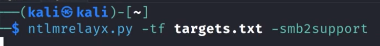

# 🛡️ SMB Relay Attacks Lab

> **Course:** [Practical Ethical Hacking](../../README.md)  
> **Module:** [Attacking Active Directory: Initial Attack Vectors](./README.md)  
> **Navigation Path:** `Practical Ethical Hacking > Attacking Active Directory: Initial Attack Vectors > SMB Relay Attacks Lab`

---

## 🎯 Executive Summary & Technical Objectives
This document details the practical methodology, tooling, exploitation chain, and defensive remediation for **SMB Relay Attacks Lab** as conducted in the TCM Security lab environment.

---

## 🔬 Hands-On Walkthrough & Technical Evidence

Identify the host with SMB enabled but not required
Put the ip addresses in the target file
Change responder.conf file and siwtch off SMB n http
can verify that they r off by running responder
then

*Figure: Lab Execution Screenshot / Proof of Exploit*

---

## 🛡️ Defensive Hardening & Detection Signatures
- **Monitoring & Auditing:** Enable granular auditing for process creation (Windows Event ID 4688 / Sysmon Event 1) and network connections (Sysmon Event 3).
- **Least Privilege:** Enforce strict principle of least privilege across user accounts and service configurations.
- **Continuous Validation:** Conduct routine vulnerability scanning and automated configuration reviews to identify drift.

---
[⬅ Back to Attacking Active Directory: Initial Attack Vectors](./README.md) • [🏠 Master Course Index](../README.md)
