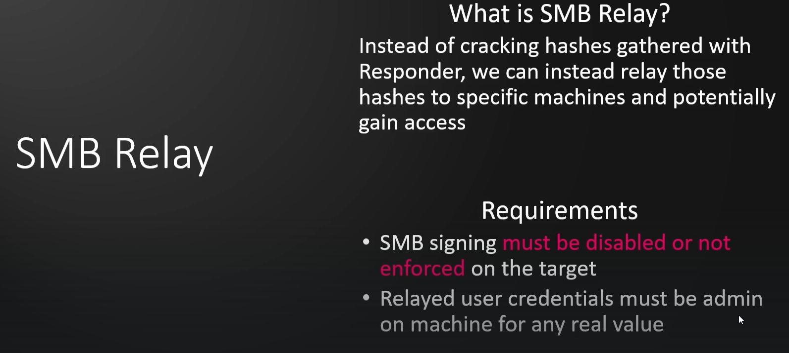
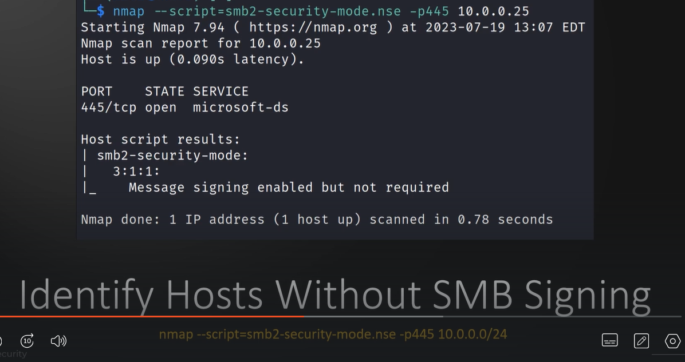
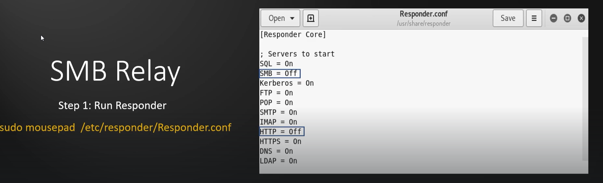
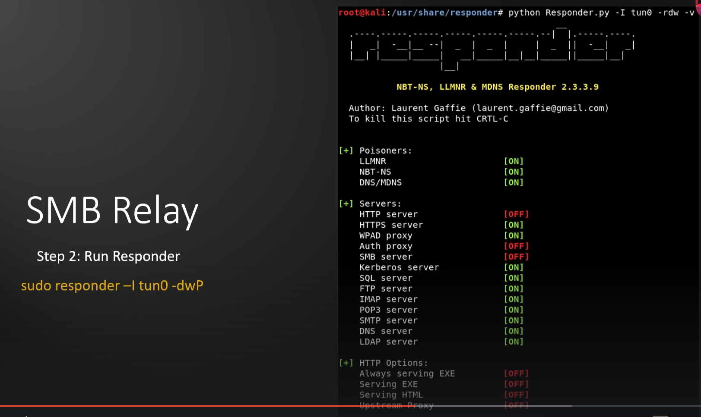
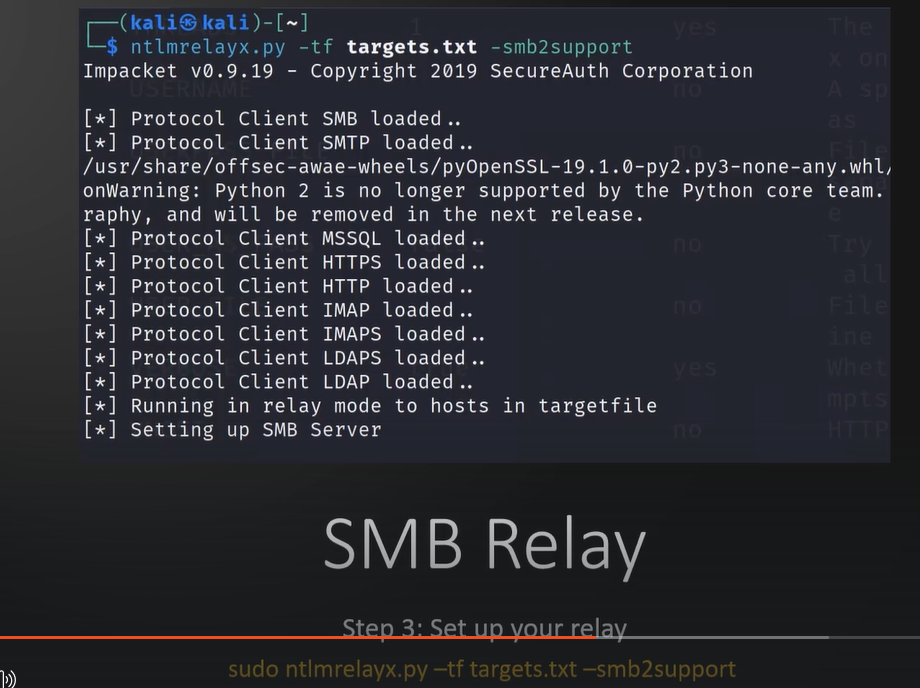
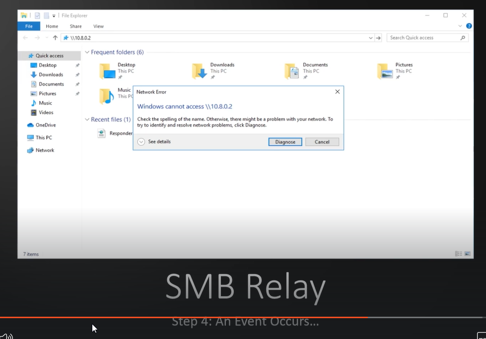
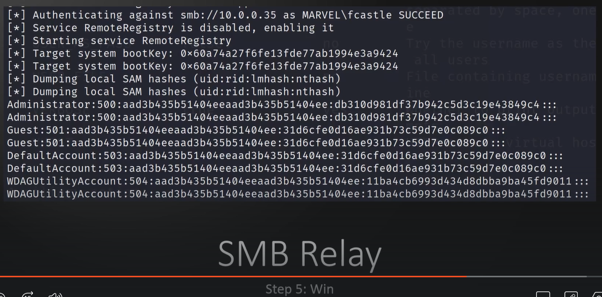
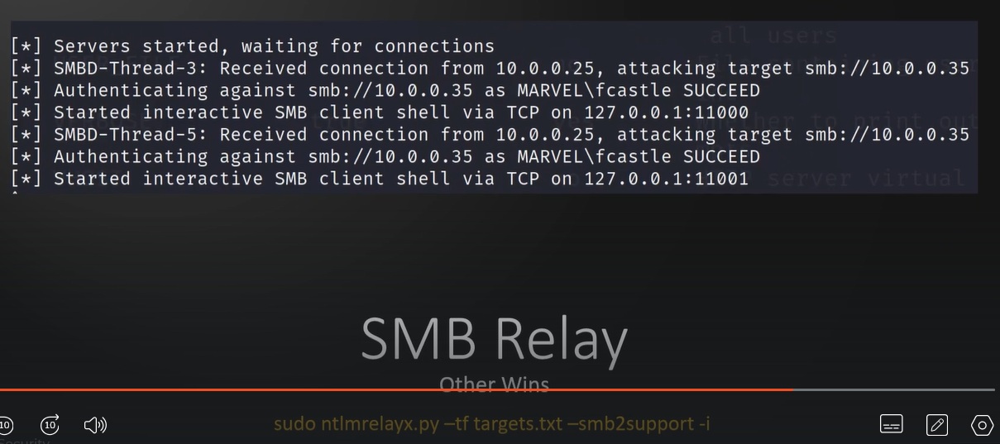
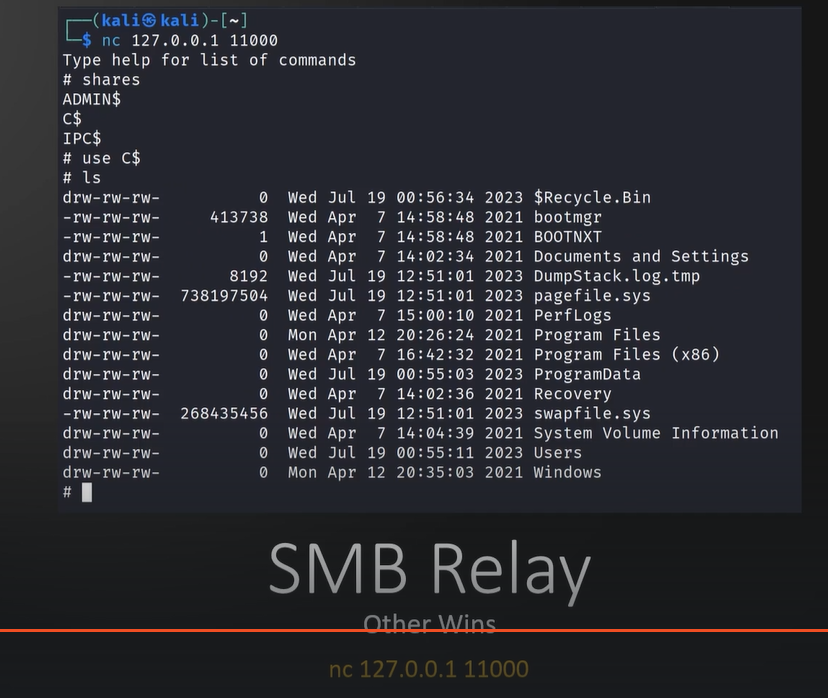
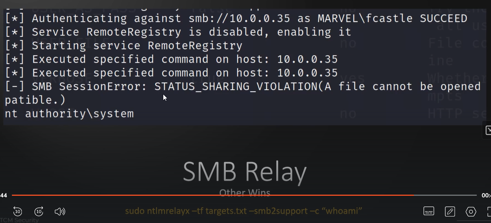

# 🛡️ SMB Relay Attacks Overview

> **Course:** [Practical Ethical Hacking](../../README.md)  
> **Module:** [Attacking Active Directory: Initial Attack Vectors](./README.md)  
> **Navigation Path:** `Practical Ethical Hacking > Attacking Active Directory: Initial Attack Vectors > SMB Relay Attacks Overview`

---

## 🎯 Executive Summary & Technical Objectives
This document details the practical methodology, tooling, exploitation chain, and defensive remediation for **SMB Relay Attacks Overview** as conducted in the TCM Security lab environment.

---

## 🔬 Hands-On Walkthrough & Technical Evidence

If hash cant b cracked, can use smb replay if it is enabled or target machine to ain access

*Figure: Lab Execution Screenshot / Proof of Exploit*

We can use nmap to check the snb port. We are mainly looking for “ Message siging enabled but not required “ . This can be used as a proof of concept as well

*Figure: Lab Execution Screenshot / Proof of Exploit*

Rember we had said everything below should be on, But for this attack we need the snb and http to be off because we jst dont need tht to captured but we want to relay them 

*Figure: Lab Execution Screenshot / Proof of Exploit*

Run responder

*Figure: Lab Execution Screenshot / Proof of Exploit*

Set up relay

*Figure: Lab Execution Screenshot / Proof of Exploit*

When responder catches a hash it will forward that to this 

Make an evnt to occur

*Figure: Lab Execution Screenshot / Proof of Exploit*

*Figure: Lab Execution Screenshot / Proof of Exploit*

Other alternative wins (pay attention to the commands )

We can add a -I to get an interactive shell

*Figure: Lab Execution Screenshot / Proof of Exploit*

*Figure: Lab Execution Screenshot / Proof of Exploit*

The following whoami can be used as proof of concept

*Figure: Lab Execution Screenshot / Proof of Exploit*

---

## 🛡️ Defensive Hardening & Detection Signatures
- **Monitoring & Auditing:** Enable granular auditing for process creation (Windows Event ID 4688 / Sysmon Event 1) and network connections (Sysmon Event 3).
- **Least Privilege:** Enforce strict principle of least privilege across user accounts and service configurations.
- **Continuous Validation:** Conduct routine vulnerability scanning and automated configuration reviews to identify drift.

---
[⬅ Back to Attacking Active Directory: Initial Attack Vectors](./README.md) • [🏠 Master Course Index](../README.md)
