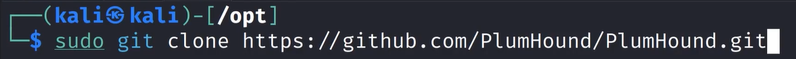
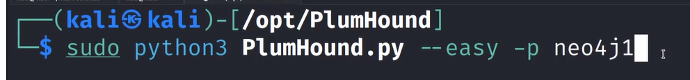
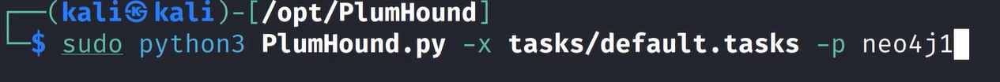

# Domain Enumeration with Plumhound

Sister of bloodhound
Search it on google wil get github pg of it go there copy that to the opt folder


cd plumhound 

```bash
sudo pip install -r requirements,txt
```
—help (to check commands for yourself)

Check to c if it runs 


This will pull down information from bloodhound and analyze it
Bloodhound should be open for this to work
-p is the neo4j password we set



-x for exceute
This puts a lot of reports in a file
can read with index.html the whole thing
It gives a lot of information abt the system


---
[Back to Attacking Active Directory: Post-Compromise Enumeration ](./README.md)
