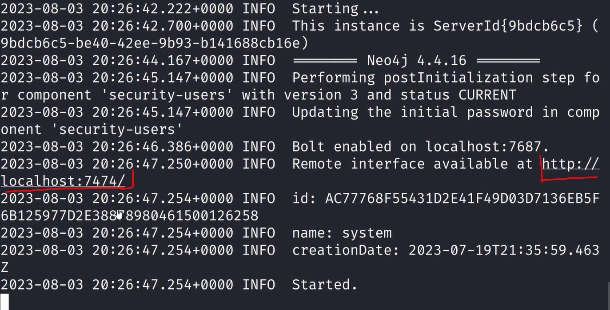
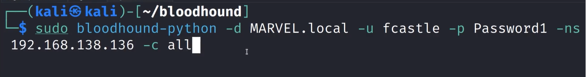

# Domain Enumeration with bloodhound


Install blood hound

```bash
sudo pip install bloodhound
```

run

```bash
sudo neo4j console
```
This is requied for us to use blood hound



it will give you this link, open it
Username: neo4j : password: neo4j
It might ask you to change password always remember the password 

Run blood hound

```bash
sudo bloodhound
```
I will ask you for the username and password of neo4j



-d is for domain
-ns is for name server (domain controller ip)
-c is for what are you collecting

Import all the information in blood hound
Go to the analyis tab on top
It displays all the ifo in a graphical manner 


---
[Back to Attacking Active Directory: Post-Compromise Enumeration ](./README.md)
