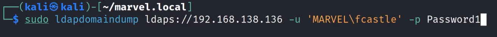

# Domain Enumeration with ldapdomaindump

This for gethering information

the ip address of ldaps if the one of the domain controller 

---
[Back to Attacking Active Directory: Post-Compromise Enumeration ](./README.md)
