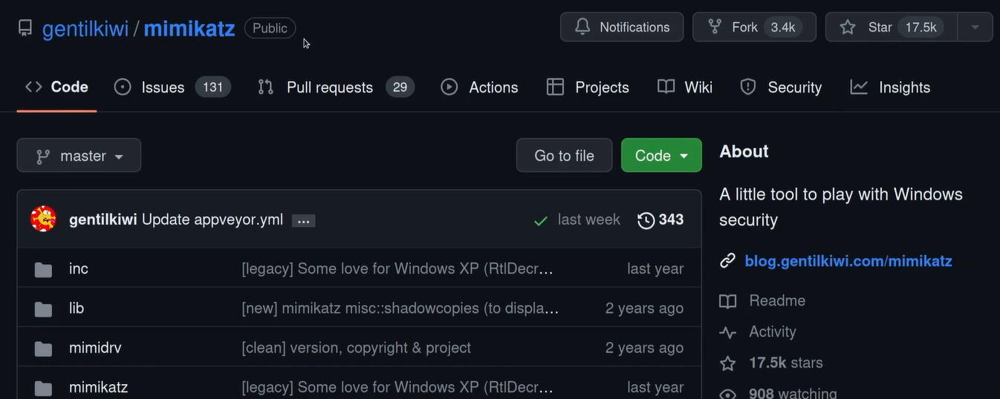
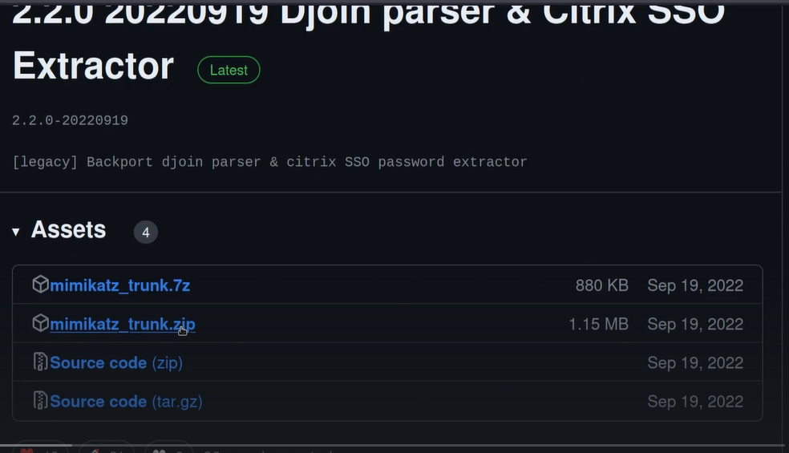
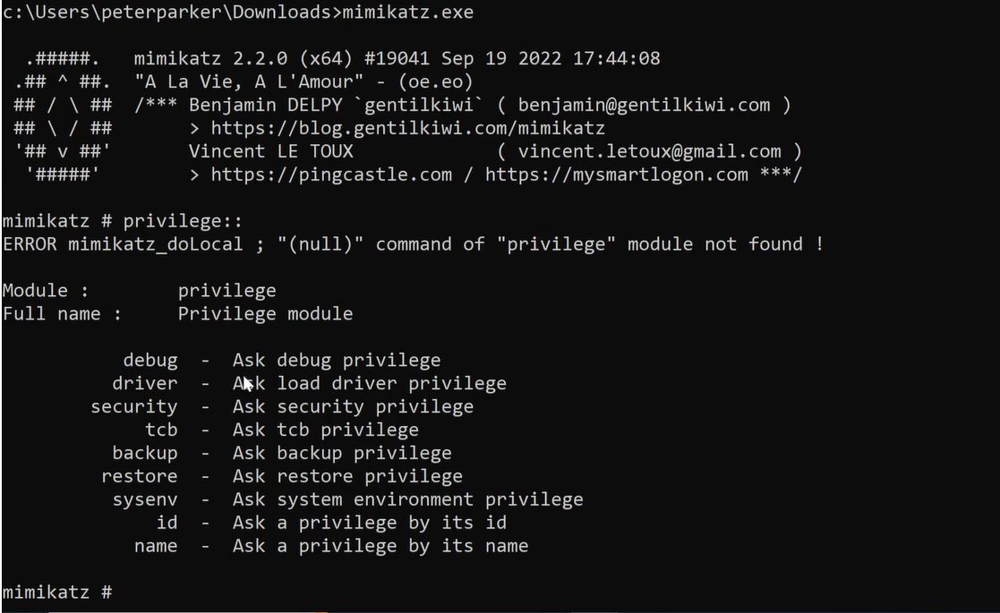
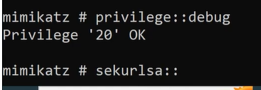

# Credential Dumping

how to downlaod

go to latest releases 
You will get some warning because the tool is very dangerous 
Download the zip or 7z file of it

after dowloading 
open the x64 folder of it
and extract those files 
after that get those files to the target machine 

on the target machine run 

set privillage to debug

If can disable antivirus this is a very very powerful attack

---
[Back to Attacking Active Directory: Post-Compromise Attacks ](./README.md)
