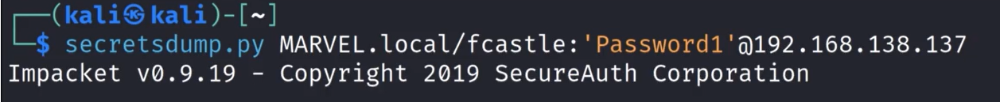
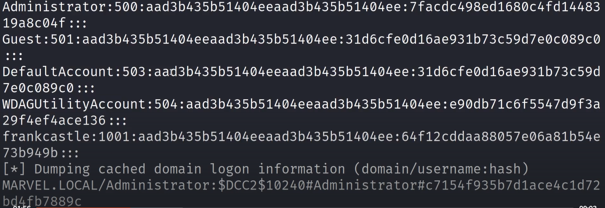
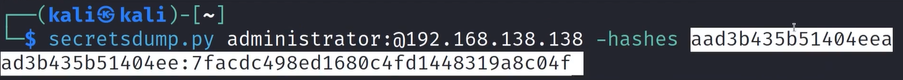
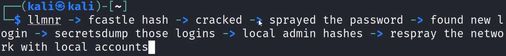

# 🛡️ Dumping and Cracking Hashes

> **Course:** [Practical Ethical Hacking](../../README.md)  
> **Module:** [Attacking Active Directory: Post-Compromise Attacks ](./README.md)  
> **Navigation Path:** `Practical Ethical Hacking > Attacking Active Directory: Post-Compromise Attacks  > Dumping and Cracking Hashes`

---

## 🎯 Executive Summary & Technical Objectives
This document details the practical methodology, tooling, exploitation chain, and defensive remediation for **Dumping and Cracking Hashes** as conducted in the TCM Security lab environment.

---

## 🔬 Hands-On Walkthrough & Technical Evidence

If i get an account and log in, it is better to dumb secrets for more information, can use a tool such as secretsdump

With password

*Figure: Lab Execution Screenshot / Proof of Exploit*

U can try to crack the dcc hash or other hashes and c if anything good you get

The main things you are looking for are the SAM hashes

*Figure: Lab Execution Screenshot / Proof of Exploit*

The important ones here are the administrator and any other user accounts
Guest, defaultaccount and utility account are not that grt

If the passwords are stored on the registory we can see it in clear text
wdigest (only on older versions) we can use this protocol also to check for password stored in clear text
U can also switch the wdigest on and wait for someone to log in so can get their password (close the switch after your work is done, otherwise you will be leaving back vulnerabilities bck which is not good)
Use wdigest as lst resort if you actually very desperate
Go through all the accounts you can access through using secretsdump

This is how to do it with hash

*Figure: Lab Execution Screenshot / Proof of Exploit*

General pathaway/methadology (fcastle is the local user)

*Figure: Lab Execution Screenshot / Proof of Exploit*

We can crack the hashesh 
We need only nt portion to crack the passowrd (the lst part)
Can crack the hash using hash cat or other hash cracker

---

## 🛡️ Defensive Hardening & Detection Signatures
- **Monitoring & Auditing:** Enable granular auditing for process creation (Windows Event ID 4688 / Sysmon Event 1) and network connections (Sysmon Event 3).
- **Least Privilege:** Enforce strict principle of least privilege across user accounts and service configurations.
- **Continuous Validation:** Conduct routine vulnerability scanning and automated configuration reviews to identify drift.

---
[⬅ Back to Attacking Active Directory: Post-Compromise Attacks ](./README.md) • [🏠 Master Course Index](../README.md)
